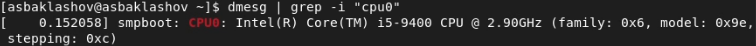

---
## Front matter
lang: ru-RU
title: Лабораторная работа №1. Установка и конфигурация операционной системы на виртуальную машину.
author: |
	Alexander S. Baklashov
institute: |
	RUDN University, Moscow, Russian Federation

date: 07 September, 2022

## Formatting
toc: false
slide_level: 2
theme: metropolis
header-includes: 
 - \metroset{progressbar=frametitle,sectionpage=progressbar,numbering=fraction}
 - '\makeatletter'
 - '\beamer@ignorenonframefalse'
 - '\makeatother'
aspectratio: 43
section-titles: true
---

# Цель работы

Целью данной работы является приобретение практических навыков установки операционной системы на виртуальную машину, настройки минимально необходимых для дальнейшей работы сервисов.

# Выполнение лабораторной работы

## Запуск VirtualBox

Запустим VirtualBox 

{ #fig:001 width=55% }

## Создание виртуальной машины

Создадим новую виртуальную машину.Укажем имя виртуальной машины (asbaklashov), тип операционной системы — Linux, RedHat  

{ #fig:002 width=70% }

## Создание виртуальной машины

Укажем размер основной памяти виртуальной машины $-$ 2048 Мб. 

{ #fig:003 width=70% }

## Создание виртуальной машины

Зададим конфигурацию жёсткого диска — загрузочный, VDI (BirtualBox Disk Image), динамический виртуальный диск. Зададим размер диска — 50 ГБ и его расположение.

{ #fig:004 width=60% }

## Создание виртуальной машины

Добавим новый привод оптических дисков и выберите образ операционной системы.

{ #fig:005 width=70% }

## Создание виртуальной машины

Запустим виртуальную машину 

{ #fig:006 width=70% }

## Создание виртуальной машины

Выберем English в качестве языка интерфейса 

{ #fig:007 width=70% }

## Создание виртуальной машины

Перейдём к настройкам установки операционной системы 

{ #fig:008 width=70% }

## Создание виртуальной машины

В разделе выбора программ укажем в качестве базового окружения Server with GUI, а в качестве дополнения — Development Tools 

{ #fig:009 width=70% }

## Создание виртуальной машины

Отключим KDUMP 

{ #fig:010 width=70% }

## Создание виртуальной машины

Место установки ОС оставим без изменения 

{ #fig:011 width=70% }

## Создание виртуальной машины

Включим сетевое соединение и в качестве имени узла укажите asbaklashov.localdomain 

{ #fig:012 width=70% }

## Создание виртуальной машины

Установим пароль для root 

{ #fig:013 width=70% }

## Создание виртуальной машины

Зададим пользователя с правами администратора 

{ #fig:014 width=70% }

## Создание виртуальной машины

После завершения установки операционной системы корректно перезапустим виртуальную машину 

{ #fig:015 width=70% }

## Создание виртуальной машины

Подключим образ диска дополнений гостевой ОС 

{ #fig:016 width=70% }

## Создание виртуальной машины

После загрузки дополнений нажмём Enter и корректно перезагрузим виртуальную машину. 

{ #fig:017 width=70% }

# Домашнее задание

## Домашнее задание

Необходимо получить следующую информацию:

1. Версия ядра Linux (Linux version).

2. Частота процессора (Detected Mhz processor).

3. Модель процессора (CPU0).

4. Объем доступной оперативной памяти (Memory available).

5. Тип обнаруженного гипервизора (Hypervisor detected).

6. Тип файловой системы корневого раздела.

7. Последовательность монтирования файловых систем.

## Домашнее задание. Версия ядра Linux.

Версия ядра Linux (Linux version). 

{ #fig:018 width=90% }

## Домашнее задание. Частота процессора.

Частота процессора (Detected Mhz processor). 

{ #fig:019 width=90% }

## Домашнее задание. Модель процессора.

Модель процессора (CPU0). 

{ #fig:020 width=90% }

## Домашнее задание. Объем доступной оперативной памяти.

Объем доступной оперативной памяти (Memory available). 

{ #fig:021 width=90% }

## Домашнее задание. Тип обнаруженного гипервизора.

Тип обнаруженного гипервизора (Hypervisor detected). 

{ #fig:022 width=90% }

## Домашнее задание. Тип файловой системы корневого раздела.

Тип файловой системы корневого раздела. 

{ #fig:023 width=90% }

## Домашнее задание. Последовательность монтирования файловых систем.

Последовательность монтирования файловых систем. 

{ #fig:024 width=90% }

# Выводы

В ходе данной лабораторной работы я приобрёл практические навыки установки операционной системы на виртуальную машину, настройки минимально необходимых для дальнейшей работы сервисов.