---
# Front matter
title: "Отчёт по лабораторной работе №1. Установка и конфигурация операционной системы на виртуальную машину."
subtitle: "Предмет: информационная безопасность"
author: "Александр Сергеевич Баклашов"

# Generic otions
lang: ru-RU
toc-title: "Содержание"

# Bibliography
bibliography: bib/cite.bib
csl: pandoc/csl/gost-r-7-0-5-2008-numeric.csl

# References settings
linkReferences: true
nameInLink: true

# Pdf output format
toc: true # Table of contents
toc_depth: 2
lof: true # List of figures
lot: false # List of tables
fontsize: 12pt
linestretch: 1.5
papersize: a4
documentclass: scrreprt
## I18n
polyglossia-lang:
  name: russian
  options:
	- spelling=modern
	- babelshorthands=true
polyglossia-otherlangs:
  name: english
### Fonts
mainfont: PT Serif
romanfont: PT Serif
sansfont: PT Sans
monofont: PT Mono
mainfontoptions: Ligatures=TeX
romanfontoptions: Ligatures=TeX
sansfontoptions: Ligatures=TeX,Scale=MatchLowercase
monofontoptions: Scale=MatchLowercase,Scale=0.9
## Biblatex
biblatex: true
biblio-style: "gost-numeric"
biblatexoptions:
  - parentracker=true
  - backend=biber
  - hyperref=auto
  - language=auto
  - autolang=other*
  - citestyle=gost-numeric
## Misc options
indent: true
header-includes:
  - \linepenalty=10 # the penalty added to the badness of each line within a paragraph (no associated penalty node) Increasing the value makes tex try to have fewer lines in the paragraph.
  - \interlinepenalty=0 # value of the penalty (node) added after each line of a paragraph.
  - \hyphenpenalty=50 # the penalty for line breaking at an automatically inserted hyphen
  - \exhyphenpenalty=50 # the penalty for line breaking at an explicit hyphen
  - \binoppenalty=700 # the penalty for breaking a line at a binary operator
  - \relpenalty=500 # the penalty for breaking a line at a relation
  - \clubpenalty=150 # extra penalty for breaking after first line of a paragraph
  - \widowpenalty=150 # extra penalty for breaking before last line of a paragraph
  - \displaywidowpenalty=50 # extra penalty for breaking before last line before a display math
  - \brokenpenalty=100 # extra penalty for page breaking after a hyphenated line
  - \predisplaypenalty=10000 # penalty for breaking before a display
  - \postdisplaypenalty=0 # penalty for breaking after a display
  - \floatingpenalty = 20000 # penalty for splitting an insertion (can only be split footnote in standard LaTeX)
  - \raggedbottom # or \flushbottom
  - \usepackage{float} # keep figures where there are in the text
  - \floatplacement{figure}{H} # keep figures where there are in the text
---

# Цель работы

Целью данной работы является приобретение практических навыков установки операционной системы на виртуальную машину, настройки минимально необходимых для дальнейшей работы сервисов. [1]

# Теоретическое введение

Информационная безопасность – это защищенность информации и поддерживающей инфраструктуры от случайных или преднамеренных воздействий естественного или искусственного характера, чреватых нанесением ущерба владельцам или пользователям информации и поддерживающей инфраструктуры.

Rocky Linux - дистрибутив Linux, разработанный Rocky Enterprise Software Foundation. Предполагается, что это будет нисходящий, полный двоично-совместимый релиз с использованием исходного кода операционной системы Red Hat Enterprise Linux (RHEL). Целью проекта является создание поддерживаемой сообществом корпоративной операционной системы производственного уровня. Rocky Linux, наряду с Red Hat Enterprise Linux и SUSE Linux Enterprise, стала популярной для использования в корпоративных операционных системах. [2]

# Выполнение лабораторной работы

## Запуск VirtualBox

1. Запустим VirtualBox (рис. [-@fig:001])

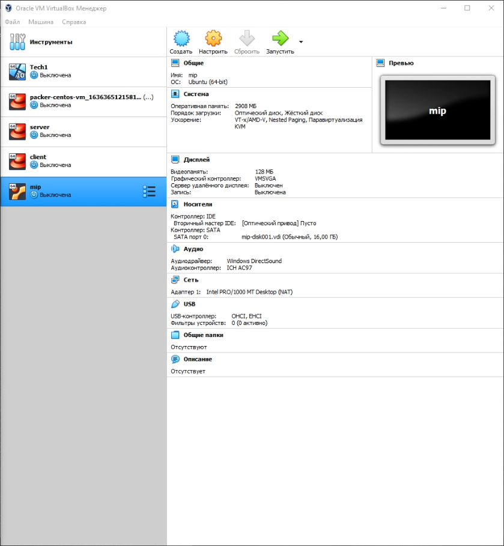{ #fig:001 width=80% }

## Создание виртуальной машины

2. Создадим новую виртуальную машину.Укажем имя виртуальной машины (asbaklashov), тип операционной системы — Linux, RedHat  (рис. [-@fig:002])

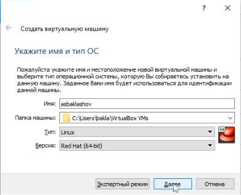{ #fig:002 width=90% }

3. Укажем размер основной памяти виртуальной машины $-$ 2048 Мб. (рис. [-@fig:003])

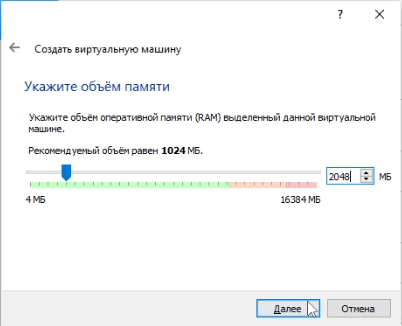{ #fig:003 width=90% }

4. Зададим конфигурацию жёсткого диска — загрузочный, VDI (BirtualBox Disk Image), динамический виртуальный диск. Зададим размер диска — 50 ГБ и его расположение. (рис. [-@fig:004])

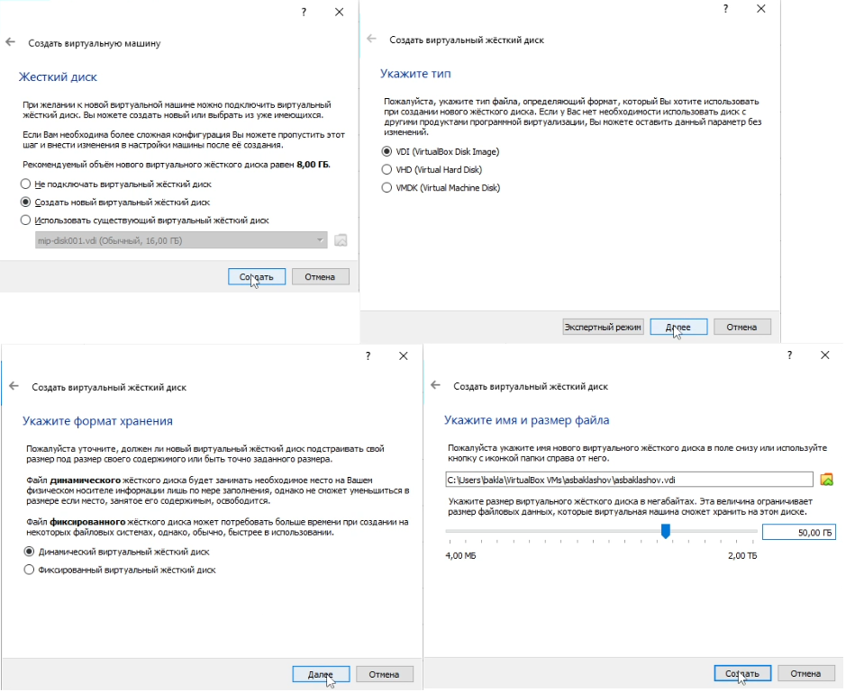{ #fig:004 width=70% }

5. Добавим новый привод оптических дисков и выберите образ операционной системы (рис. [-@fig:005])

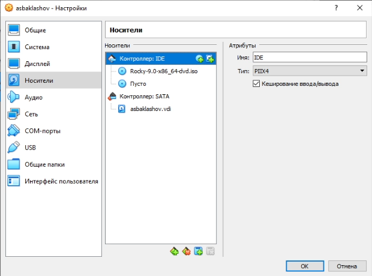{ #fig:005 width=90% }

6. Запустим виртуальную машину (рис. [-@fig:006])

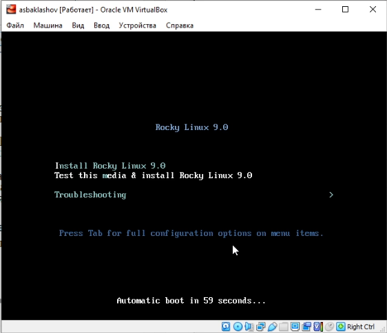{ #fig:006 width=90% }

7. Выберем English в качестве языка интерфейса (рис. [-@fig:007])

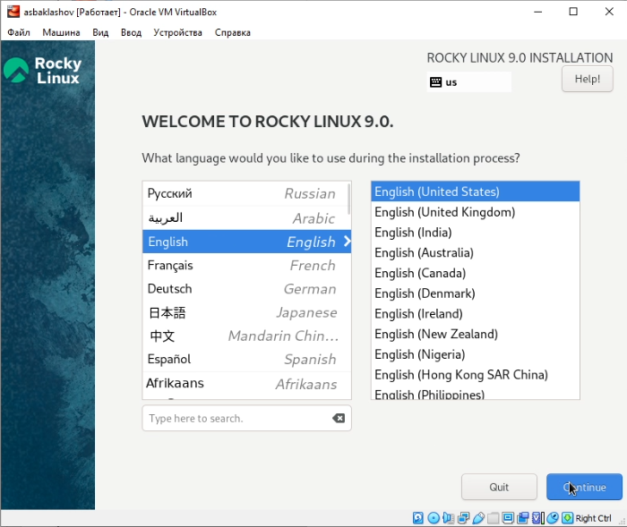{ #fig:007 width=90% }

8. Перейдём к настройкам установки операционной системы (рис. [-@fig:008])

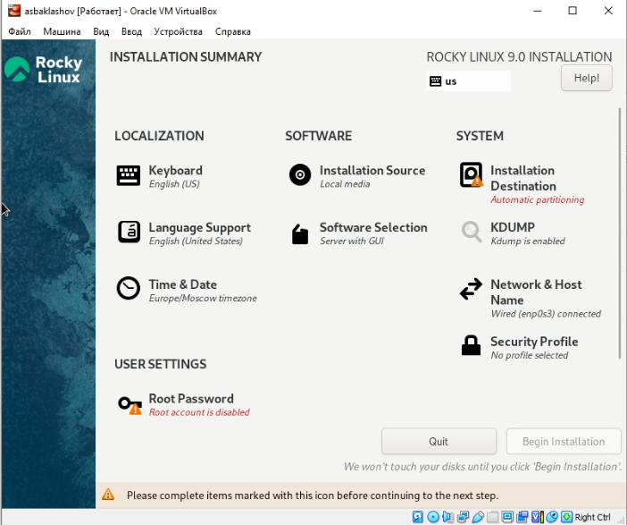{ #fig:008 width=90% }

9. В разделе выбора программ укажем в качестве базового окружения Server with GUI, а в качестве дополнения — Development Tools (рис. [-@fig:009])

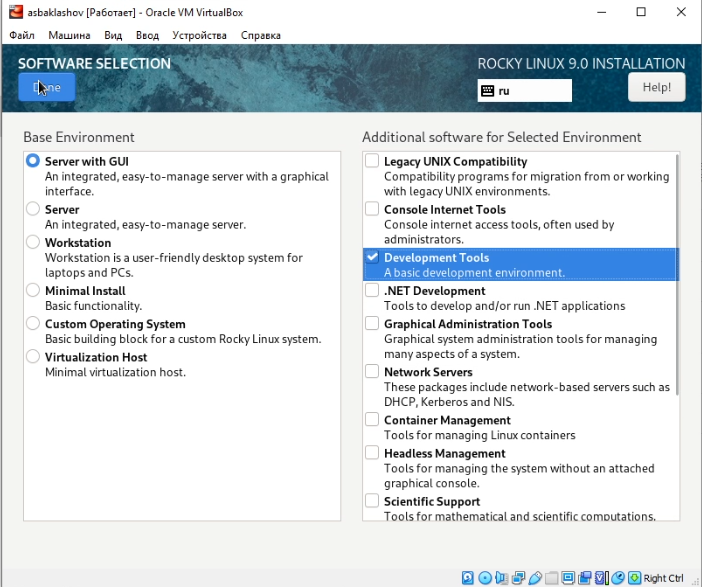{ #fig:009 width=90% }

10. Отключим KDUMP (рис. [-@fig:010])

{ #fig:010 width=90% }

11. Место установки ОС оставим без изменения (рис. [-@fig:011])

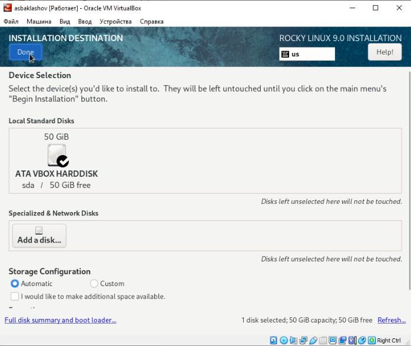{ #fig:011 width=90% }

12. Включим сетевое соединение и в качестве имени узла укажите asbaklashov.localdomain (рис. [-@fig:012])

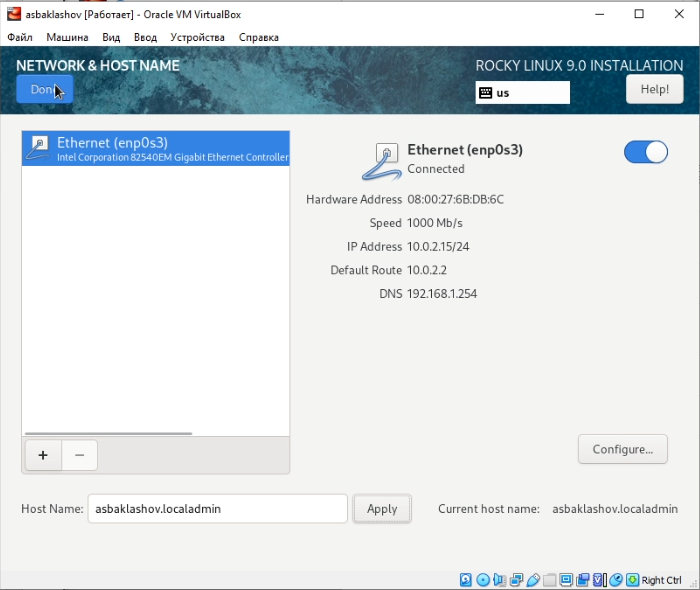{ #fig:012 width=90% }

13. Установим пароль для root (рис. [-@fig:013])

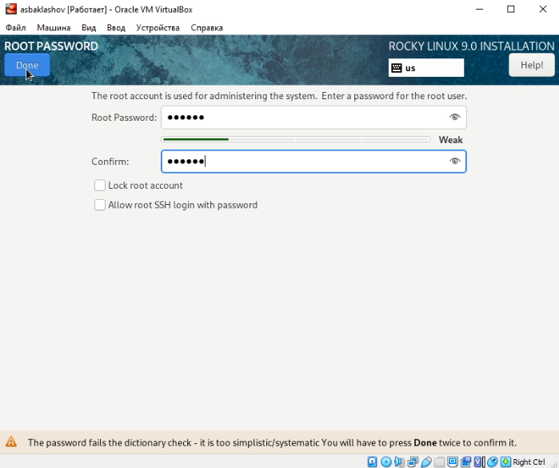{ #fig:013 width=90% }

14. Зададим пользователя с правами администратора (рис. [-@fig:014])

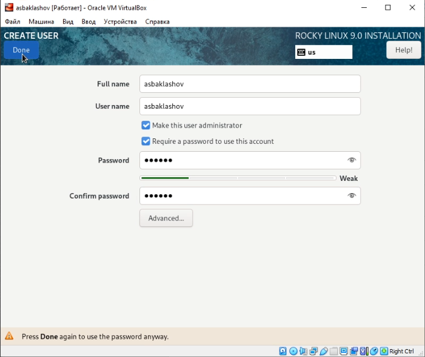{ #fig:014 width=90% }

15. После завершения установки операционной системы корректно перезапустим виртуальную машину (рис. [-@fig:015])

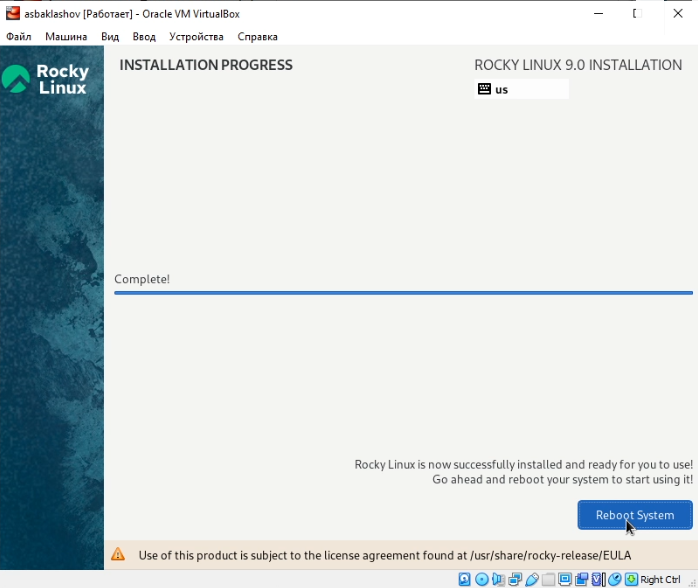{ #fig:015 width=90% }

16. Подключим образ диска дополнений гостевой ОС (рис. [-@fig:016])

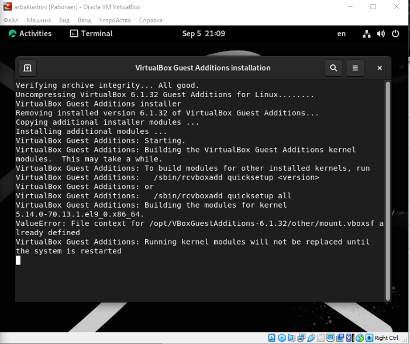{ #fig:016 width=90% }

17. После загрузки дополнений нажмём Enter и корректно перезагрузим виртуальную машину. (рис. [-@fig:017])

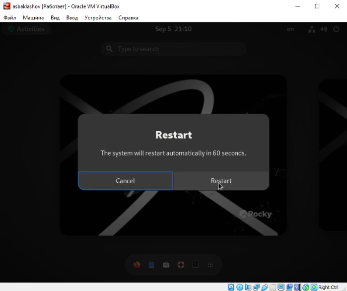{ #fig:017 width=90% }

# Домашнее задание

Путём ввода команды "dmesg | grep -i "то, что ищем"" получим следующую информацию:
1. Версия ядра Linux (Linux version). (рис. [-@fig:018])

{ #fig:018 width=90% }

5.14.0-70.13.1.el9_0.x86_64

2. Частота процессора (Detected Mhz processor). (рис. [-@fig:019])

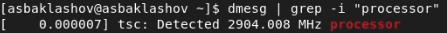{ #fig:019 width=90% }

2904.008 MHz

3. Модель процессора (CPU0). (рис. [-@fig:020])

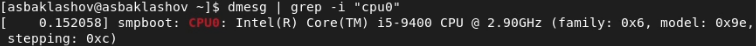{ #fig:020 width=90% }

4. Объем доступной оперативной памяти (Memory available). (рис. [-@fig:021])

{ #fig:021 width=90% }

260860K

5. Тип обнаруженного гипервизора (Hypervisor detected). (рис. [-@fig:022])

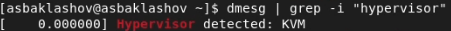{ #fig:022 width=90% }

KVM

6. Тип файловой системы корневого раздела. (рис. [-@fig:023])

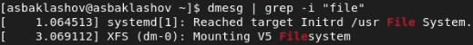{ #fig:023 width=90% }

XFS

7. Последовательность монтирования файловых систем. (рис. [-@fig:024])

{ #fig:024 width=90% }

XFS (dm-0), Huge Pages File System, POSIX Message Queue File System, Kernel Debug File System, Kernel Trace File System, XFS (sda1)

# Вывод

В ходе данной лабораторной работы я приобрёл практические навыки установки операционной системы на виртуальную машину, настройки минимально необходимых для дальнейшей работы сервисов.

# Контрольные вопросы

1. Какую информацию содержит учётная запись пользователя?

Учётная запись содержит данные о пользователе, необходимые для регистрации в системе и дальнейшей работы с ней.

2. Укажите команды терминала и приведите примеры:
– для получения справки по команде;

Команда man (man ls) (рис. [-@fig:025])

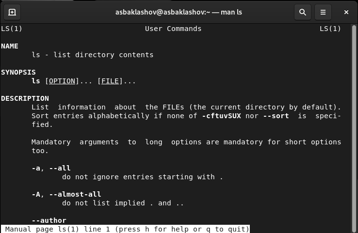{ #fig:025 width=90% }

– для перемещения по файловой системе;

Команда cd (cd ./Desktop) (рис. [-@fig:026])

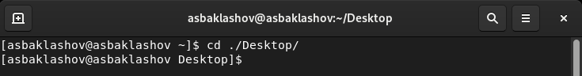{ #fig:026 width=90% }

– для просмотра содержимого каталога;

ls (рис. [-@fig:027])

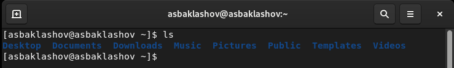{ #fig:027 width=90% }

– для определения объёма каталога;

sudo du -sh "путь к каталогу" (sudo du -sh ./Desktop) (рис. [-@fig:028])

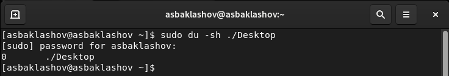{ #fig:028 width=90% }

– для создания / удаления каталогов / файлов;

touch "Имя_файла" / mkdir "Имя_каталога" / rmdir "Имя_каталога" / rm "Имя_файла" (touch Example / mkdir Example / rmdir Example / rm Example) (рис. [-@fig:029])

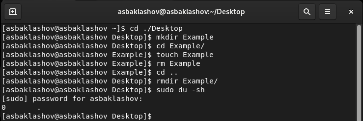{ #fig:029 width=90% }

– для задания определённых прав на файл / каталог;

chmod (chmod 777 Example) (рис. [-@fig:030])

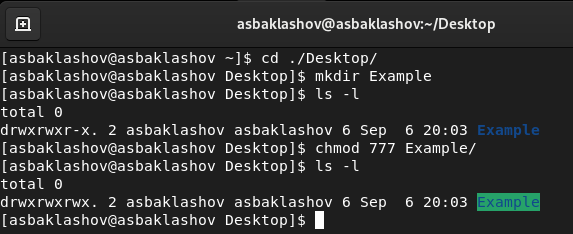{ #fig:030 width=90% }

– для просмотра истории команд. (рис. [-@fig:031])

history

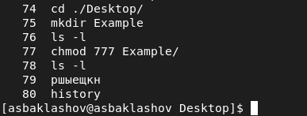{ #fig:031 width=90% }

3. Что такое файловая система? Приведите примеры с краткой характеристикой.

Файловая система — порядок, определяющий способ организации, хранения и именования данных на носителях информации в компьютерах, а также в других типах электронного оборудования. Файловая система определяет формат содержимого и способ физического хранения информации, которую принято группировать в виде файлов. Конкретная файловая система определяет размер имен файлов (и каталогов), максимальный возможный размер файла и раздела, набор атрибутов файла. Некоторые файловые системы предоставляют сервисные возможности, например, разграничение доступа или шифрование файлов. [3]

Примеры файловых систем:

- NTFS (new technology file system — «файловая система новой технологии») — стандартная файловая система для семейства операционных систем Windows NT фирмы Microsoft.

- FAT32 (от англ. File Allocation Table — «таблица размещения файлов») — это файловая система, разработанная компанией Microsoft, разновидность FAT. FAT32 — предпоследняя (перед FAT64, также известной как exFAT) версия файловой системы FAT и улучшение предыдущей версии, известной как FAT16. 

- XFS — высокопроизводительная 64-битная журналируемая файловая система, созданная компанией Silicon Graphics для собственной операционной системы IRIX. Поддержка XFS была включена в основное ядро Linux версии 2.4 и 2.6, и, таким образом, она стала довольно универсальной для Linux-систем.

- ext4 (fourth extended file system, ext4fs) — журналируемая файловая система, используемая преимущественно в операционных системах с ядром Linux, созданная на базе ext3 в 2006 году.

4. Как посмотреть, какие файловые системы подмонтированы в ОС?

С помощью команды mount (рис. [-@fig:032])

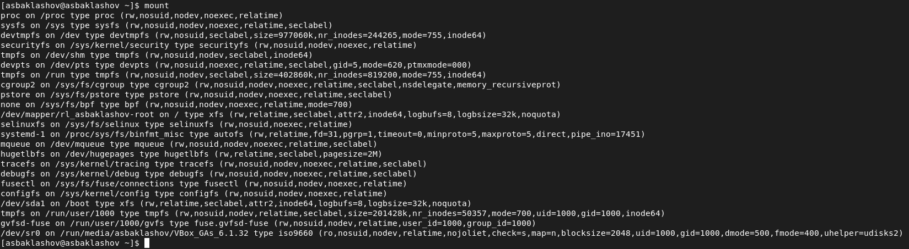{ #fig:032 width=90% }

5. Как удалить зависший процесс?

Найти PID процесса с помощью команды pidof "Имя процесса", а затем для его удаления прописать команду kill "PID".

# Библиография

1. Лабораторная работа №1. Установка и конфигурация операционной системы на виртуальную машину. - 14 с. [Электронный ресурс]. М. URL: [Лабораторная работа №1](https://esystem.rudn.ru/pluginfile.php/1651880/mod_folder/content/0/001-lab_virtualbox.pdf) (Дата обращения: 06.09.2022).

2. Rocky Linux Documentation. [Электронный ресурс]. М. URL: [Rocky Linux Documentation](https://docs.rockylinux.org) (Дата обращения: 06.09.2022).

3. Файловая система. [Электронный ресурс]. М. URL: [Файловая система](https://ru.wikipedia.org/wiki/Файловая_система) (Дата обращения: 06.09.2022).