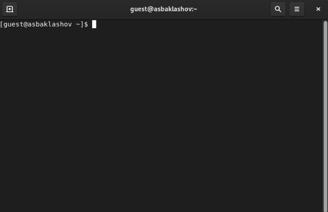

---
## Front matter
lang: ru-RU
title: Лабораторная работа №2. Дискреционное разграничение прав в Linux. Основные атрибуты.
author: |
	Alexander S. Baklashov
institute: |
	RUDN University, Moscow, Russian Federation

date: 17 September, 2022

## Formatting
toc: false
slide_level: 2
theme: metropolis
header-includes: 
 - \metroset{progressbar=frametitle,sectionpage=progressbar,numbering=fraction}
 - '\makeatletter'
 - '\beamer@ignorenonframefalse'
 - '\makeatother'
aspectratio: 43
section-titles: true
---

# Цель работы

Получение практических навыков работы в консоли с атрибутами файлов, закрепление теоретических основ дискреционного разграничения доступа в современных системах с открытым кодом на базе ОС Linux.

# Выполнение лабораторной работы

## Создание пользователя guest

В установленной при выполнении предыдущей лабораторной работы операционной системе создадим учётную запись пользователя guest (использую учётную запись администратора):

{ #fig:001 width=70% }

## Создание пользователя guest

Зададим пароль для пользователя guest (используя учётную запись администратора

{ #fig:002 width=70% }

## Создание пользователя guest

Войдём в систему от имени пользователя guest

{ #fig:003 width=70% }

## Уточнение параметров учётной записи

Определим директорию, в которой вы находитесь, командой pwd. Сравним её с приглашением командной строки. Определим, является ли она вашей домашней директорией? Если нет, зайдём в домашнюю директорию.

{ #fig:004 width=70% }

## Уточнение параметров учётной записи

Уточним имя вашего пользователя командой whoami 

{ #fig:005 width=70% }

## Уточнение параметров учётной записи

Уточним имя вашего пользователя, его группу, а также группы, куда входит пользователь, командой id. Выведенные значения uid, gid и др. запомним. Сравним вывод id с выводом команды groups.

{ #fig:006 width=70% }

Вывод команды id совпадает с выводом команды groups (guest)

## Уточнение параметров учётной записи

Сравним полученную информацию об имени пользователя с данными, выводимыми в приглашении командной строки.

{ #fig:007 width=90% }

Данные совпадают.

## Уточнение параметров учётной записи

Просмотрим файл /etc/passwd командой cat /etc/passwd

Найдём в нём свою учётную запись. Определим uid пользователя. Определим gid пользователя.

{ #fig:008 width=90% }

gid и uid совпадают со значениями из прошлых пунктов.

## Работа с правами

Определим существующие в системе директории командой

{ #fig:009 width=90% }

Поддиректории /home - /guest и /asbaklashov.

На директориях установлены права на чтение, запись и выполнение для владельца

## Работа с правами

Проверим, какие расширенные атрибуты установлены на поддиректориях, находящихся в директории /home, командой

{ #fig:010 width=90% }

Расширенные атрибуты удалось увидеть.

Расширенные атрибуты директиорий других пользователей удалось увидеть только от root.

## Работа с правами

Создадим в домашней директории поддиректорию dir1 командой mkdir dir1 

Определим командами ls -l и lsattr, какие права доступа и расширенные атрибуты были выставлены на директорию dir1.

{ #fig:011 width=50% }

Директории даны все права доступа, кроме права на запись всем остальным пользователям. Расширенных атрибутов нет.

## Работа с правами

Снимием с директории dir1 все атрибуты командой chmod 000 dir1

{ #fig:012 width=80% }

## Работа с правами

Попытаемся создать в директории dir1 файл file1 командой echo "test" > /home/guest/dir1/file1

{ #fig:013 width=80% }

Создать файл не получилось, т.к. у папки /dir нет права на запись в неё. Файл file1 в папке /dir не создался.

## Работа с правами

Заполним таблицу «Установленные права и разрешённые действия», выполняя действия от имени владельца директории (файлов), определив опытным путём, какие операции разрешены, а какие нет. Если операция разрешена, занесём в таблицу знак «+», если не разрешена, знак «-».

## Работа с правами

{ #fig:014 width=90% }

## Работа с правами

На основании заполненной таблицы определим те или иные минимально необходимые права для выполнения операций внутри директории dir1

{ #fig:015 width=90% }

# Выводы

В ходе данной лабораторной работы я приобрёл практические навыки работы в консоли с атрибутами файлов, закрепление теоретических основ дискреционного разграничения доступа в современных системах с открытым кодом на базе ОС Linux.