---
# Front matter
title: "Отчёт по лабораторной работе №2. Дискреционное разграничение прав в Linux. Основные атрибуты."
subtitle: "Предмет: информационная безопасность"
author: "Александр Сергеевич Баклашов"

# Generic otions
lang: ru-RU
toc-title: "Содержание"

# Bibliography
bibliography: bib/cite.bib
csl: pandoc/csl/gost-r-7-0-5-2008-numeric.csl

# References settings
linkReferences: true
nameInLink: true

# Pdf output format
toc: true # Table of contents
toc_depth: 2
lof: true # List of figures
lot: false # List of tables
fontsize: 12pt
linestretch: 1.5
papersize: a4
documentclass: scrreprt
## I18n
polyglossia-lang:
  name: russian
  options:
	- spelling=modern
	- babelshorthands=true
polyglossia-otherlangs:
  name: english
### Fonts
mainfont: PT Serif
romanfont: PT Serif
sansfont: PT Sans
monofont: PT Mono
mainfontoptions: Ligatures=TeX
romanfontoptions: Ligatures=TeX
sansfontoptions: Ligatures=TeX,Scale=MatchLowercase
monofontoptions: Scale=MatchLowercase,Scale=0.9
## Biblatex
biblatex: true
biblio-style: "gost-numeric"
biblatexoptions:
  - parentracker=true
  - backend=biber
  - hyperref=auto
  - language=auto
  - autolang=other*
  - citestyle=gost-numeric
## Misc options
indent: true
header-includes:
  - \linepenalty=10 # the penalty added to the badness of each line within a paragraph (no associated penalty node) Increasing the value makes tex try to have fewer lines in the paragraph.
  - \interlinepenalty=0 # value of the penalty (node) added after each line of a paragraph.
  - \hyphenpenalty=50 # the penalty for line breaking at an automatically inserted hyphen
  - \exhyphenpenalty=50 # the penalty for line breaking at an explicit hyphen
  - \binoppenalty=700 # the penalty for breaking a line at a binary operator
  - \relpenalty=500 # the penalty for breaking a line at a relation
  - \clubpenalty=150 # extra penalty for breaking after first line of a paragraph
  - \widowpenalty=150 # extra penalty for breaking before last line of a paragraph
  - \displaywidowpenalty=50 # extra penalty for breaking before last line before a display math
  - \brokenpenalty=100 # extra penalty for page breaking after a hyphenated line
  - \predisplaypenalty=10000 # penalty for breaking before a display
  - \postdisplaypenalty=0 # penalty for breaking after a display
  - \floatingpenalty = 20000 # penalty for splitting an insertion (can only be split footnote in standard LaTeX)
  - \raggedbottom # or \flushbottom
  - \usepackage{float} # keep figures where there are in the text
  - \floatplacement{figure}{H} # keep figures where there are in the text
---

# Цель работы

Получение практических навыков работы в консоли с атрибутами файлов, закрепление теоретических основ дискреционного разграничения доступа в современных системах с открытым кодом на базе ОС Linux. [1]

# Теоретическое введение

Информационная безопасность – это защищенность информации и поддерживающей инфраструктуры от случайных или преднамеренных воздействий естественного или искусственного характера, чреватых нанесением ущерба владельцам или пользователям информации и поддерживающей инфраструктуры.

chmod (от англ. change mode) — команда для изменения прав доступа к файлам и каталогам, используемая в Unix-подобных операционных системах. Входит в стандарт POSIX, в Coreutils. [3]

# Выполнение лабораторной работы

1. В установленной при выполнении предыдущей лабораторной работы операционной системе создадим учётную запись пользователя guest (использую учётную запись администратора): (рис. [-@fig:001])

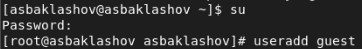{ #fig:001 width=80% }

2. Зададим пароль для пользователя guest (используя учётную запись администратора  (рис. [-@fig:002])

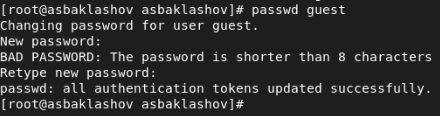{ #fig:002 width=90% }

3. Войдём в систему от имени пользователя guest (рис. [-@fig:003])

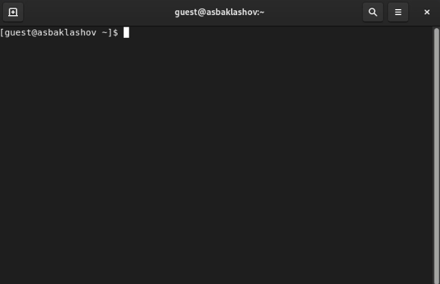{ #fig:003 width=90% }

4. Определим директорию, в которой вы находитесь, командой pwd. Сравним её с приглашением командной строки. Определим, является ли она вашей домашней директорией? Если нет, зайдём в домашнюю директорию. (рис. [-@fig:004])

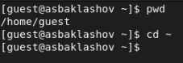{ #fig:004 width=70% }

5. Уточним имя вашего пользователя командой whoami  (рис. [-@fig:005])

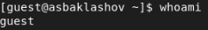{ #fig:005 width=90% }

6. Уточним имя вашего пользователя, его группу, а также группы, куда входит пользователь, командой id. Выведенные значения uid, gid и др. запомним. Сравним вывод id с выводом команды groups. (рис. [-@fig:006])

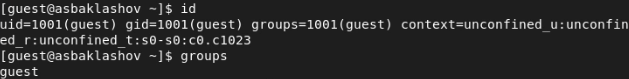{ #fig:006 width=90% }

Вывод команды id совпадает с выводом команды groups (guest)

7. Сравним полученную информацию об имени пользователя с данными, выводимыми в приглашении командной строки. (рис. [-@fig:007])

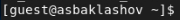{ #fig:007 width=90% }

Данные совпадают.

8. Просмотрим файл /etc/passwd командой cat /etc/passwd

Найдём в нём свою учётную запись. Определим uid пользователя. Определим gid пользователя. (рис. [-@fig:008])

{ #fig:008 width=90% }

gid и uid совпадают со значениями из прошлых пунктов.

9. Определим существующие в системе директории командой (рис. [-@fig:009])

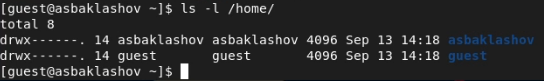{ #fig:009 width=90% }

Поддиректории /home - /guest и /asbaklashov.

На директориях установлены права на чтение, запись и выполнение для владельца

10. Проверим, какие расширенные атрибуты установлены на поддиректориях, находящихся в директории /home, командой (рис. [-@fig:010])

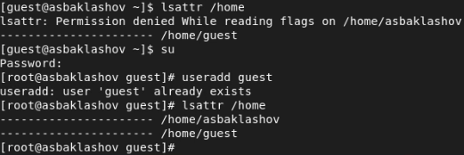{ #fig:010 width=90% }

Расширенные атрибуты удалось увидеть.

Расширенные атрибуты директиорий других пользователей удалось увидеть только от root.

11. Создадим в домашней директории поддиректорию dir1 командой mkdir dir1 

Определим командами ls -l и lsattr, какие права доступа и расширенные атрибуты были выставлены на директорию dir1. (рис. [-@fig:011])

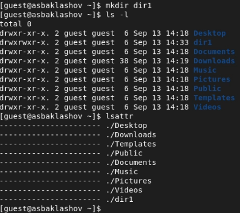{ #fig:011 width=90% }

Директории даны все права доступа, кроме права на запись всем остальным пользователям. Расширенных атрибутов нет.

12. Снимием с директории dir1 все атрибуты командой chmod 000 dir1 (рис. [-@fig:012])

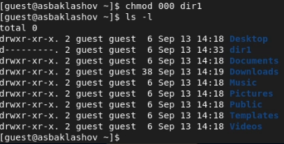{ #fig:012 width=90% }

13. Попытаемся создать в директории dir1 файл file1 командой echo "test" > /home/guest/dir1/file1 (рис. [-@fig:013])

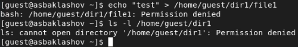{ #fig:013 width=90% }

Создать файл не получилось, т.к. у папки /dir нет права на запись в неё. Файл file1 в папке /dir не создался.

14. Заполним таблицу «Установленные права и разрешённые действия», выполняя действия от имени владельца директории (файлов), определив опытным путём, какие операции разрешены, а какие нет. Если операция разрешена, занесём в таблицу знак «+», если не разрешена, знак «-». (рис. [-@fig:014])

{ #fig:014 width=90% }

15. На основании заполненной таблицы определим те или иные минимально необходимые права для выполнения операций внутри директории dir1. (рис. [-@fig:015])

{ #fig:015 width=90% }

# Вывод

В ходе данной лабораторной работы я приобрёл практические навыки работы в консоли с атрибутами файлов, закрепление теоретических основ дискреционного разграничения доступа в современных системах с открытым кодом на базе ОС Linux.

# Библиография

1. Лабораторная работа №2. Дискреционное разграничение прав в Linux. Основные атрибуты. - 5 с. [Электронный ресурс]. М. URL: [Лабораторная работа №1](https://esystem.rudn.ru/pluginfile.php/1651883/mod_resource/content/6/002-lab_discret_attr.pdf) (Дата обращения: 17.09.2022).

2. Rocky Linux Documentation. [Электронный ресурс]. М. URL: [Rocky Linux Documentation](https://docs.rockylinux.org) (Дата обращения: 17.09.2022).

3. Chmod. [Электронный ресурс]. М. URL: [Файловая система](https://ru.wikipedia.org/wiki/Chmod) (Дата обращения: 17.09.2022).