---
## Front matter
lang: ru-RU
title: Лабораторная работа №3. Дискреционное разграничение прав в Linux. Два пользователя.
author: |
	Alexander S. Baklashov
institute: |
	RUDN University, Moscow, Russian Federation

date: 20 September, 2022

## Formatting
toc: false
slide_level: 2
theme: metropolis
header-includes: 
 - \metroset{progressbar=frametitle,sectionpage=progressbar,numbering=fraction}
 - '\makeatletter'
 - '\beamer@ignorenonframefalse'
 - '\makeatother'
aspectratio: 43
section-titles: true
---

# Цель работы

Получение практических навыков работы в консоли с атрибутами файлов для групп пользователей.

# Выполнение лабораторной работы

## Создание пользователя guest2

В установленной операционной системе создадим учётную запись пользователя guest2

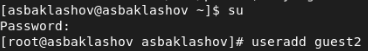{ #fig:001 width=70% }

## Создание пользователя guest2

Зададим пароль для пользователя guest2 (используя учётную запись администратора

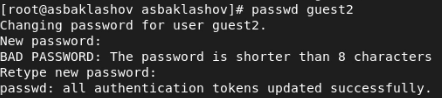{ #fig:002 width=90% }

## Создание пользователя guest2

Добавим пользователя guest2 в группу guest

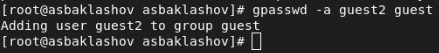{ #fig:004 width=70% }

## Уточнение параметров учётной записи

Осуществим вход в систему от двух пользователей на двух разных консолях: guest на первой консоли и guest2 на второй консоли

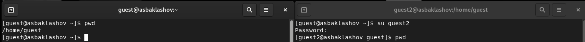{ #fig:005 width=90% }

## Уточнение параметров учётной записи

Для обоих пользователей командой pwd определим директорию, в которой вы находитесь. Сравним её с приглашениями командной строки

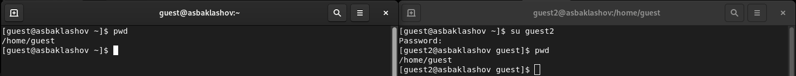{ #fig:006 width=90% }

Для guest приглашение совпадает, для guest2 - не совпадает

## Уточнение параметров учётной записи

Уточним имя пользователя, его группу, кто входит в неё и к каким группам принадлежит он сам. Определим командами groups guest и groups guest2, в какие группы входят пользователи guest и guest2. Сравним вывод команды groups с выводом команд id -Gn и id -G. 

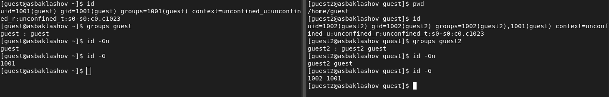{ #fig:007 width=90% }

guest входит в группу guest, guest2 входит в группу guest и guest2. Вывод команды groups совпадает с выводами команд id -Gn и id -G

## Уточнение параметров учётной записи

Сравним полученную информацию с содержимым файла /etc/group 

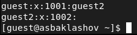{ #fig:008 width=90% }

Информация совпадает.

## Уточнение параметров учётной записи

От имени пользователя guest2 выполним регистрацию пользователя guest2 в группе guest командой 

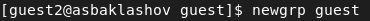{ #fig:009 width=90% }

## Работа с правами

От имени пользователя guest изменим права директории /home/guest,
разрешив все действия для пользователей группы 

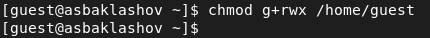{ #fig:010 width=90% }

## Работа с правами

От имени пользователя guest снимем с директории /home/guest/dir1 все атрибуты командой.

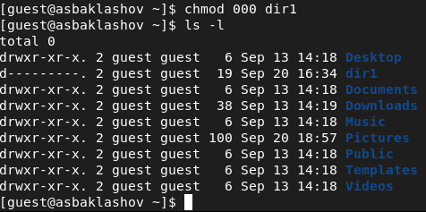{ #fig:011 width=90% }

## Работа с правами

Меняя атрибуты у директории dir1 и файла file1 от имени пользователя guest и делая проверку от пользователя guest2, заполним таблицу, определив опытным путём, какие операции разрешены, а какие нет. Если операция разрешена, занесём в таблицу знак «+», если не разрешена,
знак «-».

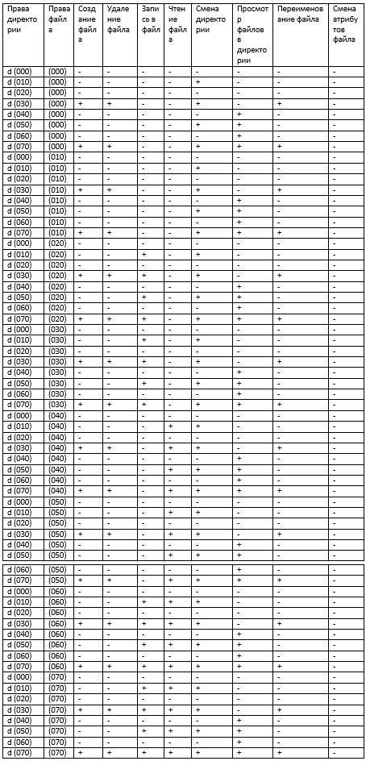{ #fig:014 width=20% }

## Работа с правами

На основании заполненной таблицы определим те или иные минимально необходимые права для выполнения операций внутри директории dir1.

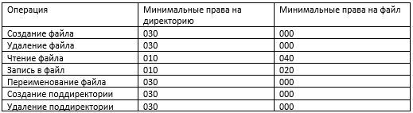{ #fig:015 width=70% }

# Выводы

В ходе данной лабораторной работы я получил практические навыки работы в консоли с атрибутами файлов для групп пользователей