---
# Front matter
title: "Отчёт по лабораторной работе №3. Дискреционное разграничение прав в Linux. Два пользователя."
subtitle: "Предмет: информационная безопасность"
author: "Александр Сергеевич Баклашов"

# Generic otions
lang: ru-RU
toc-title: "Содержание"

# Bibliography
bibliography: bib/cite.bib
csl: pandoc/csl/gost-r-7-0-5-2008-numeric.csl

# References settings
linkReferences: true
nameInLink: true

# Pdf output format
toc: true # Table of contents
toc_depth: 2
lof: true # List of figures
lot: false # List of tables
fontsize: 12pt
linestretch: 1.5
papersize: a4
documentclass: scrreprt
## I18n
polyglossia-lang:
  name: russian
  options:
	- spelling=modern
	- babelshorthands=true
polyglossia-otherlangs:
  name: english
### Fonts
mainfont: PT Serif
romanfont: PT Serif
sansfont: PT Sans
monofont: PT Mono
mainfontoptions: Ligatures=TeX
romanfontoptions: Ligatures=TeX
sansfontoptions: Ligatures=TeX,Scale=MatchLowercase
monofontoptions: Scale=MatchLowercase,Scale=0.9
## Biblatex
biblatex: true
biblio-style: "gost-numeric"
biblatexoptions:
  - parentracker=true
  - backend=biber
  - hyperref=auto
  - language=auto
  - autolang=other*
  - citestyle=gost-numeric
## Misc options
indent: true
header-includes:
  - \linepenalty=10 # the penalty added to the badness of each line within a paragraph (no associated penalty node) Increasing the value makes tex try to have fewer lines in the paragraph.
  - \interlinepenalty=0 # value of the penalty (node) added after each line of a paragraph.
  - \hyphenpenalty=50 # the penalty for line breaking at an automatically inserted hyphen
  - \exhyphenpenalty=50 # the penalty for line breaking at an explicit hyphen
  - \binoppenalty=700 # the penalty for breaking a line at a binary operator
  - \relpenalty=500 # the penalty for breaking a line at a relation
  - \clubpenalty=150 # extra penalty for breaking after first line of a paragraph
  - \widowpenalty=150 # extra penalty for breaking before last line of a paragraph
  - \displaywidowpenalty=50 # extra penalty for breaking before last line before a display math
  - \brokenpenalty=100 # extra penalty for page breaking after a hyphenated line
  - \predisplaypenalty=10000 # penalty for breaking before a display
  - \postdisplaypenalty=0 # penalty for breaking after a display
  - \floatingpenalty = 20000 # penalty for splitting an insertion (can only be split footnote in standard LaTeX)
  - \raggedbottom # or \flushbottom
  - \usepackage{float} # keep figures where there are in the text
  - \floatplacement{figure}{H} # keep figures where there are in the text
---

# Цель работы

Получение практических навыков работы в консоли с атрибутами файлов для групп пользователей. [1]

# Теоретическое введение

Информационная безопасность – это защищенность информации и поддерживающей инфраструктуры от случайных или преднамеренных воздействий естественного или искусственного характера, чреватых нанесением ущерба владельцам или пользователям информации и поддерживающей инфраструктуры.

chmod (от англ. change mode) — команда для изменения прав доступа к файлам и каталогам, используемая в Unix-подобных операционных системах. Входит в стандарт POSIX, в Coreutils. [3]

# Выполнение лабораторной работы

1. В установленной операционной системе создадим учётную запись пользователя guest2 (рис. [-@fig:001])

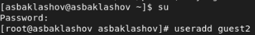{ #fig:001 width=80% }

2. Зададим пароль для пользователя guest2 (используя учётную запись администратора  (рис. [-@fig:002])

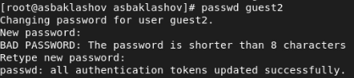{ #fig:002 width=90% }

3. Учетная запись создана.

4. Добавим пользователя guest2 в группу guest (рис. [-@fig:004])

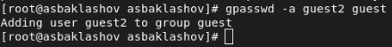{ #fig:004 width=70% }

5. Осуществим вход в систему от двух пользователей на двух разных консолях: guest на первой консоли и guest2 на второй консоли  (рис. [-@fig:005])

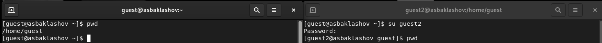{ #fig:005 width=90% }

6. Для обоих пользователей командой pwd определим директорию, в которой вы находитесь. Сравним её с приглашениями командной строки (рис. [-@fig:006])

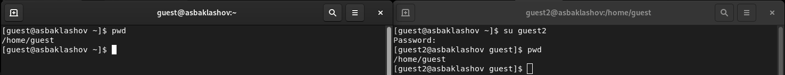{ #fig:006 width=90% }

Для guest Приглашение совпадает для guest2 - приглашение guest

7. Уточним имя пользователя, его группу, кто входит в неё и к каким группам принадлежит он сам. Определим командами groups guest и groups guest2, в какие группы входят пользователи guest и guest2. Сравним вывод команды groups с выводом команд id -Gn и id -G. (рис. [-@fig:007])

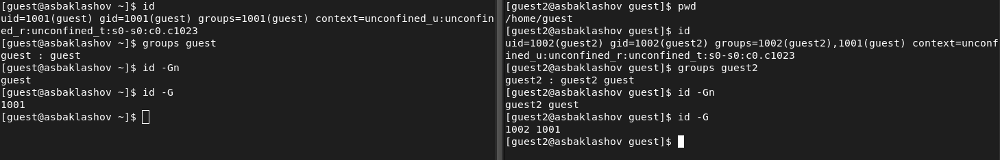{ #fig:007 width=90% }

guest выходит в группу guest, guest2 входит в группу guest и guest2. Вывод команды groups совпадает с выводами команд id -Gn и id -G

8. Сравним полученную информацию с содержимым файла /etc/group (рис. [-@fig:008])

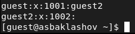{ #fig:008 width=90% }

Информация совпадает.

9. От имени пользователя guest2 выполним регистрацию пользователя guest2 в группе guest командой (рис. [-@fig:009])

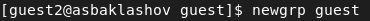{ #fig:009 width=90% }

10. От имени пользователя guest изменим права директории /home/guest,
разрешив все действия для пользователей группы (рис. [-@fig:010])

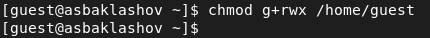{ #fig:010 width=90% }

11. От имени пользователя guest снимем с директории /home/guest/dir1 все атрибуты командой. (рис. [-@fig:011])

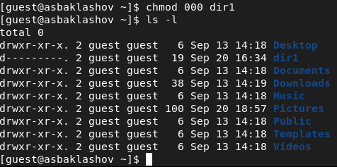{ #fig:011 width=90% }

12. Меняя атрибуты у директории dir1 и файла file1 от имени пользователя guest и делая проверку от пользователя guest2, заполним таблицу, определив опытным путём, какие операции разрешены, а какие нет. Если операция разрешена, занесём в таблицу знак «+», если не разрешена,
знак «-». (рис. [-@fig:014])

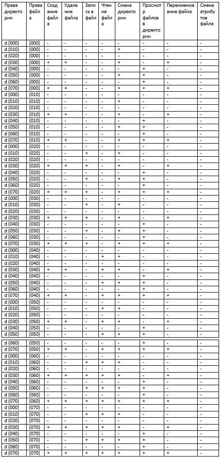{ #fig:014 width=90% }

13. На основании заполненной таблицы определим те или иные минимально необходимые права для выполнения операций внутри директории dir1. (рис. [-@fig:015])

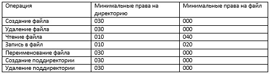{ #fig:015 width=90% }

# Вывод

В ходе данной лабораторной работы я получил практические навыки работы в консоли с атрибутами файлов для групп пользователей

# Библиография

1. Лабораторная работа №3. Дискреционное разграничение прав в Linux. Два пользователя. - 4 с. [Электронный ресурс]. М. URL: [Лабораторная работа №3](https://esystem.rudn.ru/pluginfile.php/1651885/mod_resource/content/4/003-lab_discret_2users.pdf) (Дата обращения: 20.09.2022).

2. Rocky Linux Documentation. [Электронный ресурс]. М. URL: [Rocky Linux Documentation](https://docs.rockylinux.org) (Дата обращения: 20.09.2022).

3. Chmod. [Электронный ресурс]. М. URL: [Файловая система](https://ru.wikipedia.org/wiki/Chmod) (Дата обращения: 20.09.2022).