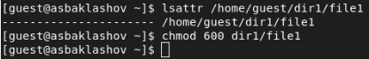
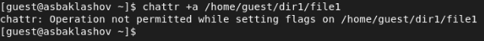
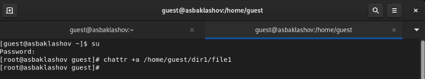
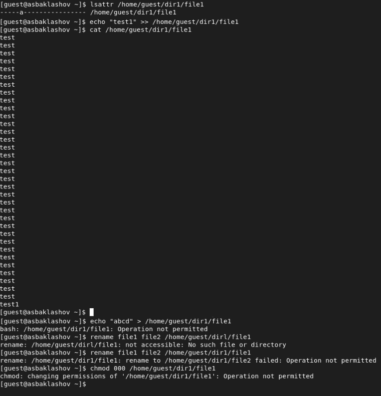
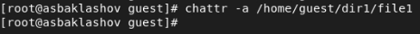
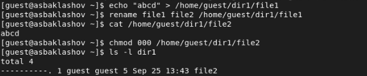
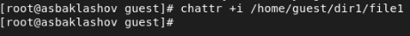
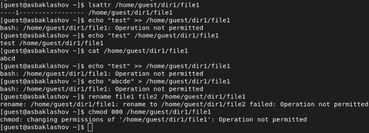

---
## Front matter
lang: ru-RU
title: Лабораторная работа №4. Дискреционное разграничение прав в Linux. Расширенные атрибуты.
author: |
	Alexander S. Baklashov
institute: |
	RUDN University, Moscow, Russian Federation

date: 25 September, 2022

## Formatting
toc: false
slide_level: 2
theme: metropolis
header-includes: 
 - \metroset{progressbar=frametitle,sectionpage=progressbar,numbering=fraction}
 - '\makeatletter'
 - '\beamer@ignorenonframefalse'
 - '\makeatother'
aspectratio: 43
section-titles: true
---

# Цель работы

Получение практических навыков работы в консоли с расширенными атрибутами файлов.

# Выполнение лабораторной работы

## Установка расширенных атрибутов

От имени пользователя guest определим расширенные атрибуты файла /home/guest/dir1/file1 командой. Установим командой chmod 600 file1 на файл file1 права, разрешающие чтение и запись для владельца файла.

{ #fig:001 width=80% }

## Установка расширенных атрибутов

Попробуем установить на файл /home/guest/dir1/file1 расширенный атрибут a от имени пользователя guest: chattr +a /home/guest/dir1/file1

{ #fig:002 width=90% }

В ответ получили отказ от выполнения операции.

## Установка расширенных атрибутов

Зайдём на третью консоль с правами администратора либо повысим свои права с помощью команды su. Попробуем установить расширенный атрибут a на файл /home/guest/dir1/file1 от имени суперпользователя: chattr +a /home/guest/dir1/file1

{ #fig:003 width=90% }

## Проверка команд

От пользователя guest проверим правильность установления атрибута: lsattr /home/guest/dir1/file1.

Выполним дозапись в файл file1 слова «test» командой
echo "test" >> /home/guest/dir1/file1

После этого выполним чтение файла file1 командой
cat /home/guest/dir1/file1

Убедимся, что слово test было успешно записано в file1.

Попробуем удалить файл file1 либо стереть имеющуюся в нём информацию командой echo "abcd" > /home/guest/dirl/file1

Попробуем переименовать файл. 

Попробуем с помощью команды chmod 000 file1 установить на файл file1 права, например, запрещающие чтение и запись для владельца файла.

## Проверка команд

{ #fig:004 width=60% }

## Проверка команд

Снимем расширенный атрибут a с файла /home/guest/dirl/file1 от имени суперпользователя командой chattr -a /home/guest/dir1/file1 Повторим операции, которые ранее не удавалось выполнить. Наблюдения занесём в отчёт.

{ #fig:005 width=90% }

## Проверка команд

{ #fig:006 width=90% }

## Проверка команд

Повторим действия по шагам, заменив атрибут «a» атрибутом «i». Удалось ли дозаписать информацию в файл?

{ #fig:007 width=90% }

## Проверка команд

{ #fig:008 width=90% }

При применении расширенного атрибута "i" ни одного из действий, представленных в лабораторной работе, совершить не удалось.

# Выводы

В результате выполнения работы я повысил свои навыки использования интерфейса командой строки (CLI), познакомился на примерах с тем, как используются основные и расширенные атрибуты при разграничении доступа. Имел возможность связать теорию дискреционного разделения доступа (дискреционная политика безопасности) с её реализацией на практике в ОС Linux. Опробовал действие на практике расширенных атрибутов «а» и «i».