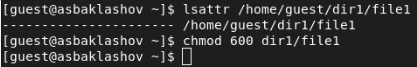
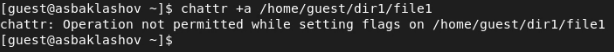
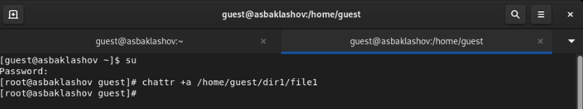
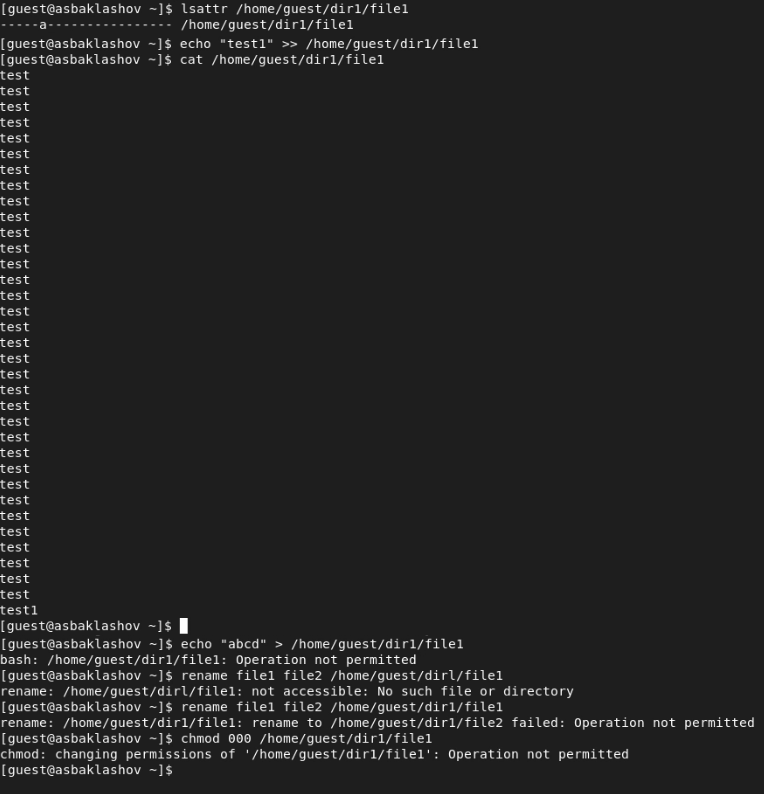
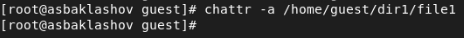
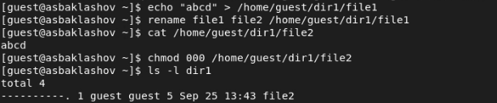
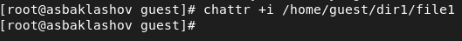
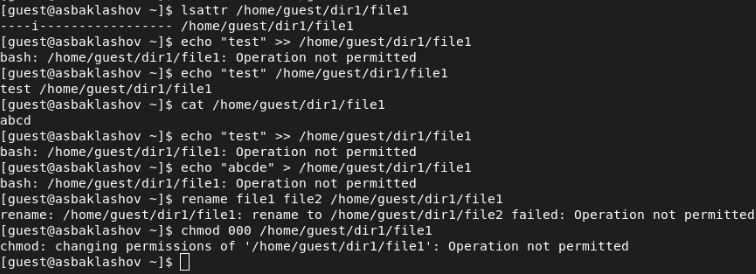

---
# Front matter
title: "Отчёт по лабораторной работе №4. Дискреционное разграничение прав в Linux. Расширенные атрибуты."
subtitle: "Предмет: информационная безопасность"
author: "Александр Сергеевич Баклашов"

# Generic otions
lang: ru-RU
toc-title: "Содержание"

# Bibliography
bibliography: bib/cite.bib
csl: pandoc/csl/gost-r-7-0-5-2008-numeric.csl

# References settings
linkReferences: true
nameInLink: true

# Pdf output format
toc: true # Table of contents
toc_depth: 2
lof: true # List of figures
lot: false # List of tables
fontsize: 12pt
linestretch: 1.5
papersize: a4
documentclass: scrreprt
## I18n
polyglossia-lang:
  name: russian
  options:
	- spelling=modern
	- babelshorthands=true
polyglossia-otherlangs:
  name: english
### Fonts
mainfont: PT Serif
romanfont: PT Serif
sansfont: PT Sans
monofont: PT Mono
mainfontoptions: Ligatures=TeX
romanfontoptions: Ligatures=TeX
sansfontoptions: Ligatures=TeX,Scale=MatchLowercase
monofontoptions: Scale=MatchLowercase,Scale=0.9
## Biblatex
biblatex: true
biblio-style: "gost-numeric"
biblatexoptions:
  - parentracker=true
  - backend=biber
  - hyperref=auto
  - language=auto
  - autolang=other*
  - citestyle=gost-numeric
## Misc options
indent: true
header-includes:
  - \linepenalty=10 # the penalty added to the badness of each line within a paragraph (no associated penalty node) Increasing the value makes tex try to have fewer lines in the paragraph.
  - \interlinepenalty=0 # value of the penalty (node) added after each line of a paragraph.
  - \hyphenpenalty=50 # the penalty for line breaking at an automatically inserted hyphen
  - \exhyphenpenalty=50 # the penalty for line breaking at an explicit hyphen
  - \binoppenalty=700 # the penalty for breaking a line at a binary operator
  - \relpenalty=500 # the penalty for breaking a line at a relation
  - \clubpenalty=150 # extra penalty for breaking after first line of a paragraph
  - \widowpenalty=150 # extra penalty for breaking before last line of a paragraph
  - \displaywidowpenalty=50 # extra penalty for breaking before last line before a display math
  - \brokenpenalty=100 # extra penalty for page breaking after a hyphenated line
  - \predisplaypenalty=10000 # penalty for breaking before a display
  - \postdisplaypenalty=0 # penalty for breaking after a display
  - \floatingpenalty = 20000 # penalty for splitting an insertion (can only be split footnote in standard LaTeX)
  - \raggedbottom # or \flushbottom
  - \usepackage{float} # keep figures where there are in the text
  - \floatplacement{figure}{H} # keep figures where there are in the text
---

# Цель работы

Получение практических навыков работы в консоли с расширенными атрибутами файлов. [1]

# Теоретическое введение

Информационная безопасность – это защищенность информации и поддерживающей инфраструктуры от случайных или преднамеренных воздействий естественного или искусственного характера, чреватых нанесением ущерба владельцам или пользователям информации и поддерживающей инфраструктуры.

chmod (от англ. change mode) — команда для изменения прав доступа к файлам и каталогам, используемая в Unix-подобных операционных системах. Входит в стандарт POSIX, в Coreutils. [3]

# Выполнение лабораторной работы

1. От имени пользователя guest определим расширенные атрибуты файла /home/guest/dir1/file1 командой. Установим командой chmod 600 file1 на файл file1 права, разрешающие чтение и запись для владельца файла. (рис. [-@fig:001])

{ #fig:001 width=80% }

2. Попробуем установить на файл /home/guest/dir1/file1 расширенный атрибут a от имени пользователя guest: chattr +a /home/guest/dir1/file1 (рис. [-@fig:002])

{ #fig:002 width=90% }

В ответ получили отказ от выполнения операции.

3. Зайдём на третью консоль с правами администратора либо повысим свои права с помощью команды su. Попробуем установить расширенный атрибут a на файл /home/guest/dir1/file1 от имени суперпользователя: chattr +a /home/guest/dir1/file1 (рис. [-@fig:003])

{ #fig:003 width=90% }

4. От пользователя guest проверим правильность установления атрибута: lsattr /home/guest/dir1/file1.

Выполним дозапись в файл file1 слова «test» командой
echo "test" >> /home/guest/dir1/file1

После этого выполним чтение файла file1 командой
cat /home/guest/dir1/file1

Убедимся, что слово test было успешно записано в file1.

Попробуем удалить файл file1 либо стереть имеющуюся в нём информацию командой echo "abcd" > /home/guest/dirl/file1

Попробуем переименовать файл. 

Попробуем с помощью команды chmod 000 file1 установить на файл file1 права, например, запрещающие чтение и запись для владельца файла. (рис. [-@fig:004])

{ #fig:004 width=70% }

5. Снимем расширенный атрибут a с файла /home/guest/dirl/file1 от имени суперпользователя командой chattr -a /home/guest/dir1/file1 Повторим операции, которые ранее не удавалось выполнить. Наблюдения занесём в отчёт. (рис. [-@fig:005], рис. [-@fig:006])

{ #fig:005 width=90% }

{ #fig:006 width=90% }

7. Повторим действия по шагам, заменив атрибут «a» атрибутом «i». Удалось ли дозаписать информацию в файл? Наблюдения занесём в отчёт. (рис. [-@fig:007], рис. [-@fig:008])

{ #fig:007 width=90% }

{ #fig:008 width=90% }

При применении расширенного атрибута "i" ни одного из действий, представленных в лабораторной работе, совершить не удалось.

# Вывод

В результате выполнения работы я повысил свои навыки использования интерфейса командой строки (CLI), познакомился на примерах с тем, как используются основные и расширенные атрибуты при разграничении доступа. Имел возможность связать теорию дискреционного разделения доступа (дискреционная политика безопасности) с её реализацией на практике в ОС Linux. Опробовал действие на практике расширенных атрибутов «а» и «i».

# Библиография

1. Лабораторная работа №4. Дискреционное разграничение прав в Linux. Расширенные атрибуты. - 4 с. [Электронный ресурс]. М. URL: [Лабораторная работа №4](https://esystem.rudn.ru/pluginfile.php/1651887/mod_resource/content/3/004-lab_discret_extattr.pdf) (Дата обращения: 25.09.2022).

2. Rocky Linux Documentation. [Электронный ресурс]. М. URL: [Rocky Linux Documentation](https://docs.rockylinux.org) (Дата обращения: 25.09.2022).

3. Chmod. [Электронный ресурс]. М. URL: [Chmod](https://ru.wikipedia.org/wiki/Chmod) (Дата обращения: 25.09.2022).