---
## Front matter
lang: ru-RU
title: Лабораторная работа №5. Дискреционное разграничение прав в Linux. Исследование влияния дополнительных атрибутов.
author: |
	Alexander S. Baklashov
institute: |
	RUDN University, Moscow, Russian Federation

date: 08 October, 2022

## Formatting
toc: false
slide_level: 2
theme: metropolis
header-includes: 
 - \metroset{progressbar=frametitle,sectionpage=progressbar,numbering=fraction}
 - '\makeatletter'
 - '\beamer@ignorenonframefalse'
 - '\makeatother'
aspectratio: 43
section-titles: true
---

# Цель работы

Изучение механизмов изменения идентификаторов, применения SetUID- и Sticky-битов. Получение практических навыков работы в консоли с дополнительными атрибутами. Рассмотрение работы механизма
смены идентификатора процессов пользователей, а также влияние бита Sticky на запись и удаление файлов.

# Выполнение лабораторной работы

## Создание программы

Войдите в систему от имени пользователя guest.

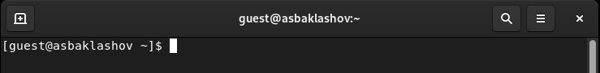{ #fig:001 width=80% }

## Создание программы

Создайте программу simpleid.c: 

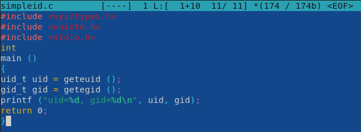{ #fig:002 width=90% }

## Создание программы

Скомплилируйте программу и убедитесь, что файл программы создан

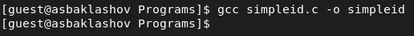{ #fig:003 width=90% }

## Создание программы

Выполните системную программу id и сравните полученный вами результат с данными предыдущего пункта задания.

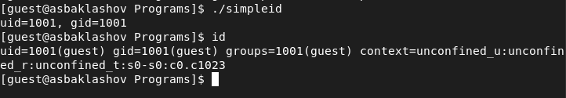{ #fig:004 width=70% }

Результаты совпадают.

## Создание программы

Усложните программу, добавив вывод действительных идентификато-
ров.

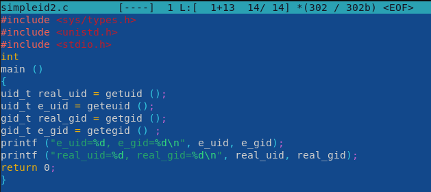{ #fig:005 width=90% }

Получившуюся программу назовите simpleid2.c

## Создание программы

Скомпилируйте и запустите simpleid2.c

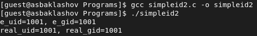{ #fig:006 width=90% }

## Создание программы

От имени суперпользователя выполните команды.

chown root:guest /home/guest/simpleid2

chmod u+s /home/guest/simpleid2 

1ая команда меняет владельца, 2ая - атрибуты

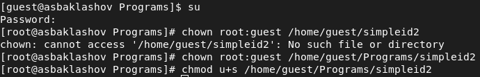{ #fig:007 width=90% }

## Создание программы

Выполните проверку правильности установки новых атрибутов и смены
владельца файла simpleid2 

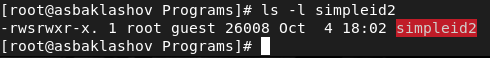{ #fig:008 width=90% }

## Создание программы

Запустите simpleid2 и id 

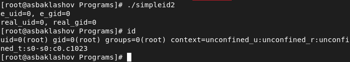{ #fig:009 width=90% }

Результаты совпадают.

## Создание программы

Проделайте тоже самое относительно SetGID-бита

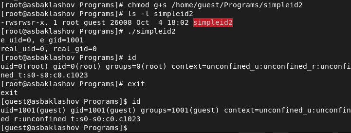{ #fig:010 width=90% }

## Создание программы

Создайте программу readfile.c

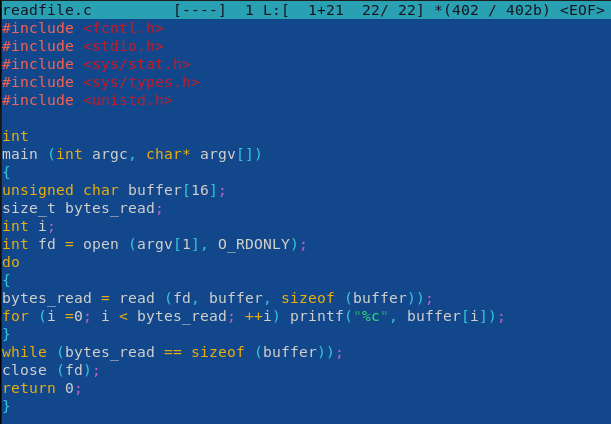{ #fig:011 width=90% }

## Создание программы

Откомпилируйте её 

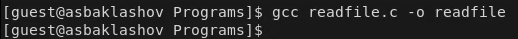{ #fig:012 width=90% }

## Создание программы

Смените владельца у файла readfile.c (или любого другого текстового файла в системе) и измените права так, чтобы только суперпользователь (root) мог прочитать его, a guest не мог 

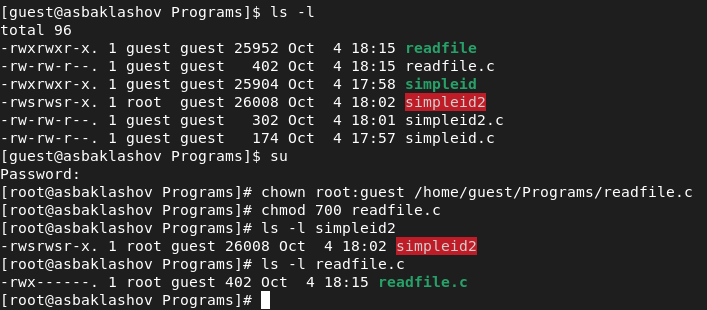{ #fig:013 width=90% }

## Создание программы

Проверьте, что пользователь guest не может прочитать файл readfile.c.

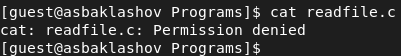{ #fig:014 width=90% }

## Создание программы

Смените у программы readfile владельца и установите SetU’D-бит 

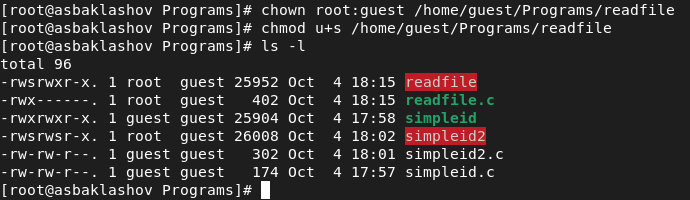{ #fig:015 width=90% }

## Создание программы

Проверьте, может ли программа readfile прочитать файл readfile.c?

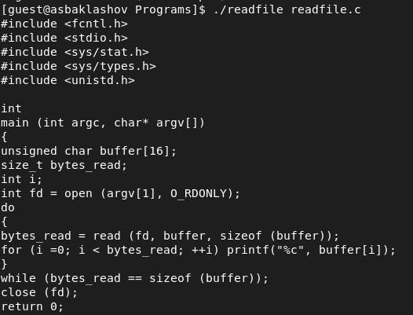{ #fig:016 width=90% }

## Создание программы

Проверьте, может ли программа readfile прочитать файл /etc/shadow? 

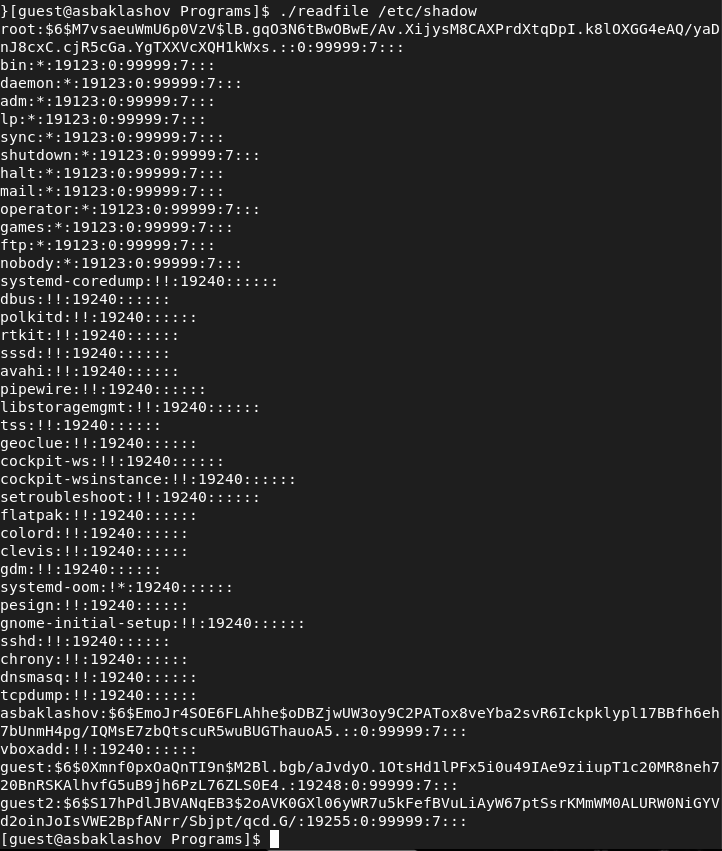{ #fig:017 width=90% }

Программа может прочитать оба файла.

## Исследование Sticky-бита

Выясните, установлен ли атрибут Sticky на директории /tmp, для чего выполните команду ls -l / | grep tmp 

Атрибут "t" установлен.

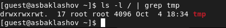{ #fig:018 width=90% }

## Исследование Sticky-бита

От имени пользователя guest создайте файл file01.txt в директории /tmp
со словом test 

Просмотрите атрибуты у только что созданного файла и разрешите чтение и запись для категории пользователей «все остальные».

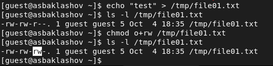{ #fig:019 width=90% }

## Исследование Sticky-бита

От пользователя guest2 (не являющегося владельцем) попробуйте прочитать файл /tmp/file01.txt

От пользователя guest2 попробуйте дозаписать в файл
/tmp/file01.txt слово test2 командой 

Проверьте содержимое файла командой
cat /tmp/file01.txt

{ #fig:020 width=90% }

## Исследование Sticky-бита

От пользователя guest2 попробуйте записать в файл /tmp/file01.txt слово test3, стерев при этом всю имеющуюся в файле информацию командой 

Проверьте содержимое файла командой
cat /tmp/file01.txt 

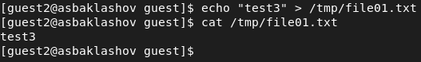{ #fig:021 width=90% }

## Исследование Sticky-бита

От пользователя guest2 попробуйте удалить файл /tmp/file01.txt командой
rm /tmp/file01.txt

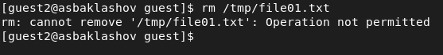{ #fig:022 width=90% }

Удалить файл не удалось

## Исследование Sticky-бита

Повысьте свои права до суперпользователя следующей командой su - и выполните после этого команду, снимающую атрибут t (Sticky-бит) с директории /tmp:
chmod -t /tmp 

Покиньте режим суперпользователя командой
exit

От пользователя guest2 проверьте, что атрибута t у директории /tmp нет:
ls -l / | grep tmp

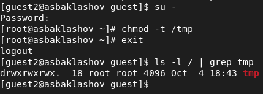{ #fig:023 width=90% }

## Исследование Sticky-бита

Повторим предыдущие шаги

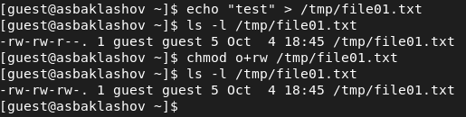{ #fig:024 width=90% }

## Исследование Sticky-бита

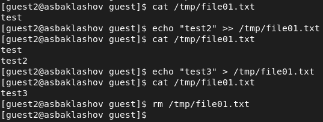{ #fig:025 width=90% }

## Исследование Sticky-бита

Повысьте свои права до суперпользователя и верните атрибут t на директорию /tmp

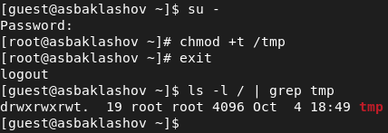{ #fig:026 width=90% }

# Выводы

В результате выполнения работы я изучил механизмы изменения идентификаторов, применения
SetUID- и Sticky-битов. Получил практические навыки работы в консоли с дополнительными атрибутами. Рассмотрел работу механизма смены идентификатора процессов пользователей, а также влияние бита Sticky на запись и удаление файлов.