---
# Front matter
title: "Отчёт по лабораторной работе №5. Дискреционное разграничение прав в Linux. Исследование влияния дополнительных атрибутов"
subtitle: "Предмет: информационная безопасность"
author: "Александр Сергеевич Баклашов"

# Generic otions
lang: ru-RU
toc-title: "Содержание"

# Bibliography
bibliography: bib/cite.bib
csl: pandoc/csl/gost-r-7-0-5-2008-numeric.csl

# References settings
linkReferences: true
nameInLink: true

# Pdf output format
toc: true # Table of contents
toc_depth: 2
lof: true # List of figures
lot: false # List of tables
fontsize: 12pt
linestretch: 1.5
papersize: a4
documentclass: scrreprt
## I18n
polyglossia-lang:
  name: russian
  options:
	- spelling=modern
	- babelshorthands=true
polyglossia-otherlangs:
  name: english
### Fonts
mainfont: PT Serif
romanfont: PT Serif
sansfont: PT Sans
monofont: PT Mono
mainfontoptions: Ligatures=TeX
romanfontoptions: Ligatures=TeX
sansfontoptions: Ligatures=TeX,Scale=MatchLowercase
monofontoptions: Scale=MatchLowercase,Scale=0.9
## Biblatex
biblatex: true
biblio-style: "gost-numeric"
biblatexoptions:
  - parentracker=true
  - backend=biber
  - hyperref=auto
  - language=auto
  - autolang=other*
  - citestyle=gost-numeric
## Misc options
indent: true
header-includes:
  - \linepenalty=10 # the penalty added to the badness of each line within a paragraph (no associated penalty node) Increasing the value makes tex try to have fewer lines in the paragraph.
  - \interlinepenalty=0 # value of the penalty (node) added after each line of a paragraph.
  - \hyphenpenalty=50 # the penalty for line breaking at an automatically inserted hyphen
  - \exhyphenpenalty=50 # the penalty for line breaking at an explicit hyphen
  - \binoppenalty=700 # the penalty for breaking a line at a binary operator
  - \relpenalty=500 # the penalty for breaking a line at a relation
  - \clubpenalty=150 # extra penalty for breaking after first line of a paragraph
  - \widowpenalty=150 # extra penalty for breaking before last line of a paragraph
  - \displaywidowpenalty=50 # extra penalty for breaking before last line before a display math
  - \brokenpenalty=100 # extra penalty for page breaking after a hyphenated line
  - \predisplaypenalty=10000 # penalty for breaking before a display
  - \postdisplaypenalty=0 # penalty for breaking after a display
  - \floatingpenalty = 20000 # penalty for splitting an insertion (can only be split footnote in standard LaTeX)
  - \raggedbottom # or \flushbottom
  - \usepackage{float} # keep figures where there are in the text
  - \floatplacement{figure}{H} # keep figures where there are in the text
---

# Цель работы

Изучение механизмов изменения идентификаторов, применения SetUID- и Sticky-битов. Получение практических навыков работы в консоли с дополнительными атрибутами. Рассмотрение работы механизма
смены идентификатора процессов пользователей, а также влияние бита Sticky на запись и удаление файлов. [1]

# Теоретическое введение

Информационная безопасность – это защищенность информации и поддерживающей инфраструктуры от случайных или преднамеренных воздействий естественного или искусственного характера, чреватых нанесением ущерба владельцам или пользователям информации и поддерживающей инфраструктуры.

chmod (от англ. change mode) — команда для изменения прав доступа к файлам и каталогам, используемая в Unix-подобных операционных системах. Входит в стандарт POSIX, в Coreutils. [3]

# Выполнение лабораторной работы

## Создание программы

1. Войдите в систему от имени пользователя guest. (рис. [-@fig:001])

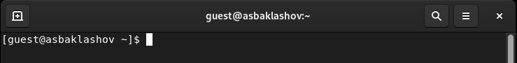{ #fig:001 width=80% }

2. Создайте программу simpleid.c: (рис. [-@fig:002])

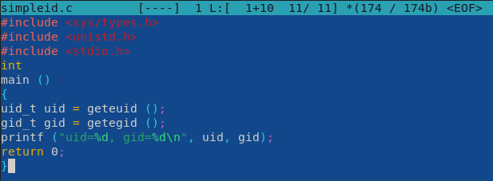{ #fig:002 width=90% }

3. Скомплилируйте программу и убедитесь, что файл программы создан (рис. [-@fig:003])

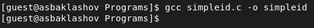{ #fig:003 width=90% }

4. Выполните программу simpleid

Выполните системную программу id и сравните полученный вами результат с данными предыдущего пункта задания. (рис. [-@fig:004])

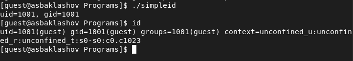{ #fig:004 width=70% }

Результаты совпадают.

5. Усложните программу, добавив вывод действительных идентификато-
ров. (рис. [-@fig:005])

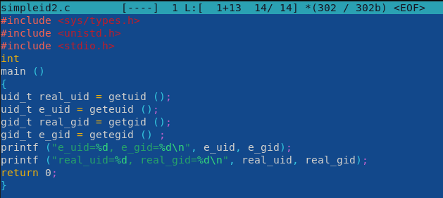{ #fig:005 width=90% }

Получившуюся программу назовите simpleid2.c

6. Скомпилируйте и запустите simpleid2.c (рис. [-@fig:006])

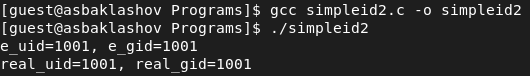{ #fig:006 width=90% }

7. От имени суперпользователя выполните команды.

chown root:guest /home/guest/simpleid2

chmod u+s /home/guest/simpleid2 (рис. [-@fig:007])

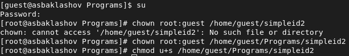{ #fig:007 width=90% }

Используйте sudo или повысьте временно свои права с помощью su.
Поясните, что делают эти команды.

1ая команда меняет владельца, 2ая - атрибуты

8. Выполните проверку правильности установки новых атрибутов и смены
владельца файла simpleid2 (рис. [-@fig:008])

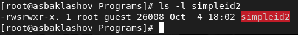{ #fig:008 width=90% }

9. Запустите simpleid2 и id (рис. [-@fig:009])

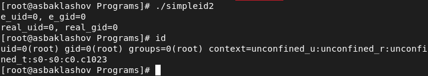{ #fig:009 width=90% }

Результаты совпадают.

10. Проделайте тоже самое относительно SetGID-бита (рис. [-@fig:010])

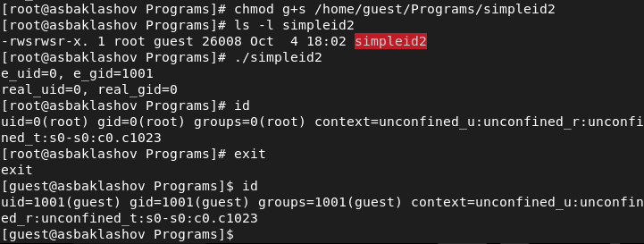{ #fig:010 width=90% }

11. Создайте программу readfile.c (рис. [-@fig:011])

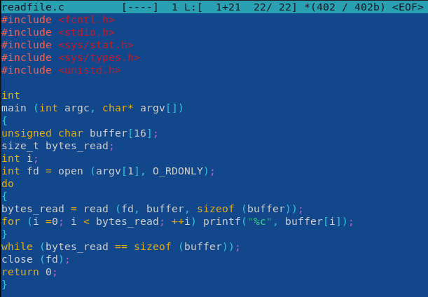{ #fig:011 width=90% }

12. Откомпилируйте её (рис. [-@fig:012])

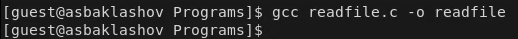{ #fig:012 width=90% }

13. Смените владельца у файла readfile.c (или любого другого текстового файла в системе) и измените права так, чтобы только суперпользователь (root) мог прочитать его, a guest не мог (рис. [-@fig:013])

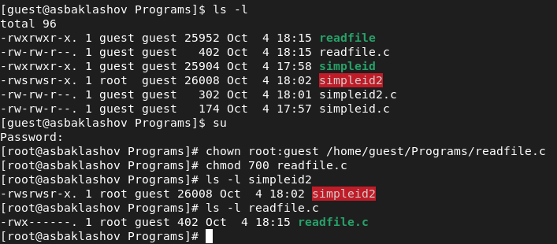{ #fig:013 width=90% }

14. Проверьте, что пользователь guest не может прочитать файл readfile.c. (рис. [-@fig:014])

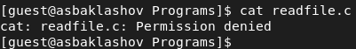{ #fig:014 width=90% }

15. Смените у программы readfile владельца и установите SetU’D-бит (рис. [-@fig:015])

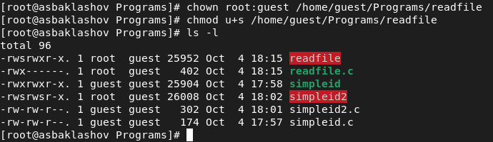{ #fig:015 width=90% }

16. Проверьте, может ли программа readfile прочитать файл readfile.c? (рис. [-@fig:016])

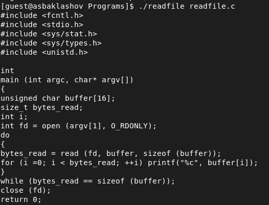{ #fig:016 width=90% }

17. Проверьте, может ли программа readfile прочитать файл /etc/shadow? (рис. [-@fig:017])

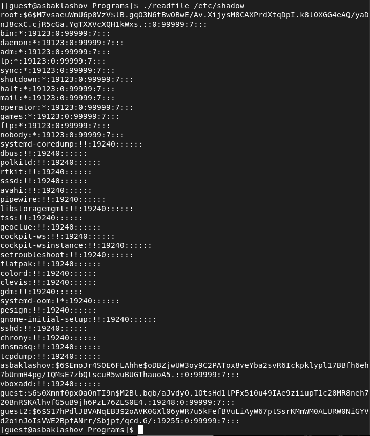{ #fig:017 width=90% }

Программа может прочитать оба файла.

## Исследование Sticky-бита

1. Выясните, установлен ли атрибут Sticky на директории /tmp, для чего выполните команду ls -l / | grep tmp (рис. [-@fig:018])

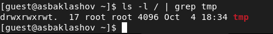{ #fig:018 width=90% }

Атрибут "t" установлен.

2. От имени пользователя guest создайте файл file01.txt в директории /tmp
со словом test 

Просмотрите атрибуты у только что созданного файла и разрешите чтение и запись для категории пользователей «все остальные». (рис. [-@fig:019])

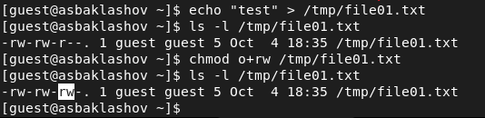{ #fig:019 width=90% }

3. От пользователя guest2 (не являющегося владельцем) попробуйте прочитать файл /tmp/file01.txt

От пользователя guest2 попробуйте дозаписать в файл
/tmp/file01.txt слово test2 командой 

Проверьте содержимое файла командой
cat /tmp/file01.txt (рис. [-@fig:020])

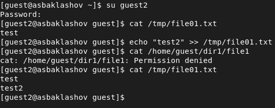{ #fig:020 width=90% }

4. От пользователя guest2 попробуйте записать в файл /tmp/file01.txt слово test3, стерев при этом всю имеющуюся в файле информацию командой 

Проверьте содержимое файла командой
cat /tmp/file01.txt (рис. [-@fig:021])

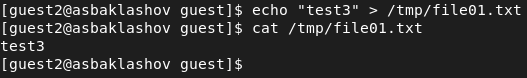{ #fig:021 width=90% }

5. От пользователя guest2 попробуйте удалить файл /tmp/file01.txt командой
rm /tmp/fileOl.txt (рис. [-@fig:022])

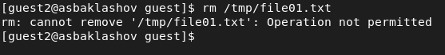{ #fig:022 width=90% }

Удалить файл не удалось

6. Повысьте свои права до суперпользователя следующей командой su - и выполните после этого команду, снимающую атрибут t (Sticky-бит) с директории /tmp:
chmod -t /tmp 

Покиньте режим суперпользователя командой
exit

От пользователя guest2 проверьте, что атрибута t у директории /tmp нет:
ls -l / | grep tmp (рис. [-@fig:023])

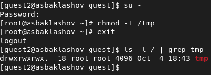{ #fig:023 width=90% }

7. Повторим предыдущие шаги (рис. [-@fig:024], рис. [-@fig:025])

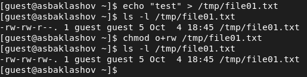{ #fig:024 width=90% }

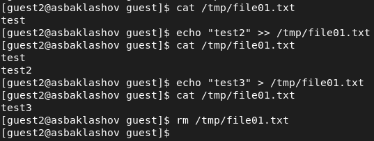{ #fig:025 width=90% }

8. Повысьте свои права до суперпользователя и верните атрибут t на директорию /tmp (рис. [-@fig:026])

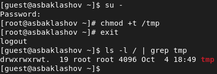{ #fig:026 width=90% }

# Вывод

В результате выполнения работы я изучил механизмы изменения идентификаторов, применения
SetUID- и Sticky-битов. Получил практические навыки работы в консоли с дополнительными атрибутами. Рассмотрел работы механизма смены идентификатора процессов пользователей, а также влияние бита Sticky на запись и удаление файлов.

# Библиография

1. Лабораторная работа №5. Дискреционное разграничение прав в Linux. Исследование влияния дополнительных атрибутов. - 7 с. [Электронный ресурс]. М. URL: [Лабораторная работа №5](https://esystem.rudn.ru/pluginfile.php/1651889/mod_resource/content/2/005-lab_discret_sticky.pdf) (Дата обращения: 08.10.2022).

2. Rocky Linux Documentation. [Электронный ресурс]. М. URL: [Rocky Linux Documentation](https://docs.rockylinux.org) (Дата обращения: 08.10.2022).

3. Chmod. [Электронный ресурс]. М. URL: [Chmod](https://ru.wikipedia.org/wiki/Chmod) (Дата обращения: 08.10.2022).