---
## Front matter
lang: ru-RU
title: Лабораторная работа  №6. Мандатное разграничение прав в Linux.
author: |
	Alexander S. Baklashov
institute: |
	RUDN University, Moscow, Russian Federation

date: 15 October, 2022

## Formatting
toc: false
slide_level: 2
theme: metropolis
header-includes: 
 - \metroset{progressbar=frametitle,sectionpage=progressbar,numbering=fraction}
 - '\makeatletter'
 - '\beamer@ignorenonframefalse'
 - '\makeatother'
aspectratio: 43
section-titles: true
---

# Цель работы

Развить навыки администрирования ОС Linux. Получить первое практическое знакомство с технологией SELinux.
Проверить работу SELinux на практике совместно с веб-сервером Apache. 

# Выполнение лабораторной работы

## Выполнение

Войдите в систему с полученными учётными данными и убедитесь, что SELinux работает в режиме enforcing политики targeted с помощью команд getenforce и sestatus.

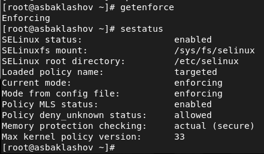{ #fig:001 width=80% }

## Выполнение

Обратитесь с помощью браузера к веб-серверу, запущенному на вашем компьютере, и убедитесь, что последний работает 

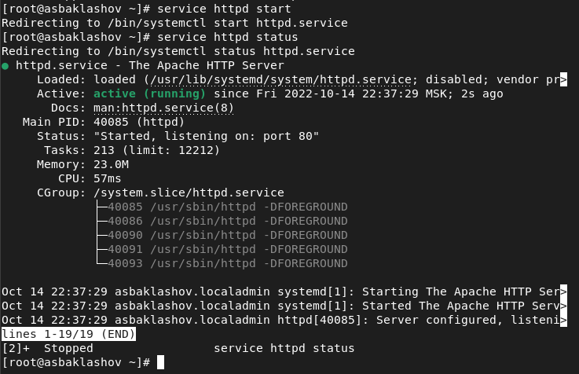{ #fig:002 width=90% }

## Выполнение

Найдите веб-сервер Apache в списке процессов, определите его контекст безопасности и занесите эту информацию в отчёт.

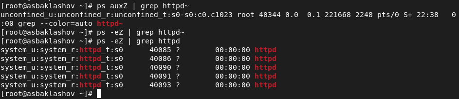{ #fig:003 width=90% }

## Выполнение

Посмотрите текущее состояние переключателей SELinux для Apache.

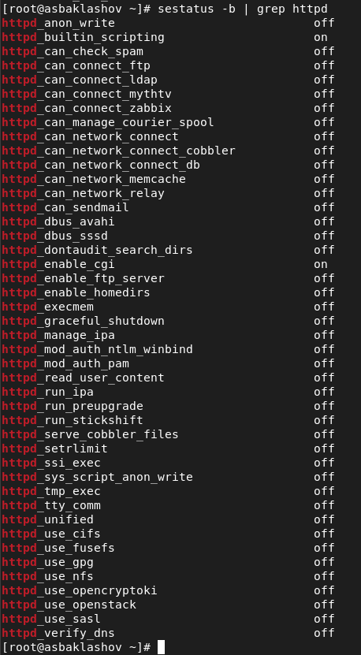{ #fig:004 width=20% }

## Выполнение

Посмотрите статистику по политике с помощью команды seinfo, также определите множество пользователей, ролей, типов.

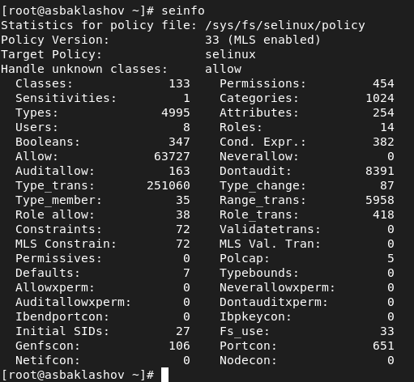{ #fig:005 width=50% }

## Выполнение

Определите тип файлов и поддиректорий, находящихся в директории 
/var/www 

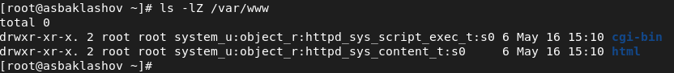{ #fig:006 width=90% }

## Выполнение

Определите тип файлов, находящихся в директории /var/www/html

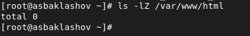{ #fig:007 width=90% }

## Выполнение

Определите круг пользователей, которым разрешено создание файлов в директории /var/www/html

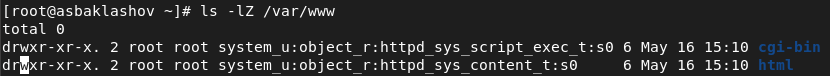{ #fig:008 width=90% }

Только владелец

## Выполнение

Создайте от имени суперпользователя (так как в дистрибутиве после установки только ему разрешена запись в директорию) html-файл 
/var/www/html/test.html

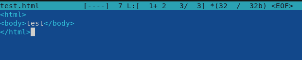{ #fig:009 width=90% }

## Выполнение

Проверьте контекст созданного вами файла. Занесите в отчёт контекст, присваиваемый по умолчанию вновь созданным файлам в директории /var/www/html

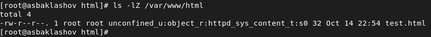{ #fig:010 width=90% }

httpd_sys_cоntent_t

## Выполнение

Обратитесь к файлу через веб-сервер, введя в браузере адрес http://127.0.0.1/test.html. Убедитесь, что файл был успешно отображён.

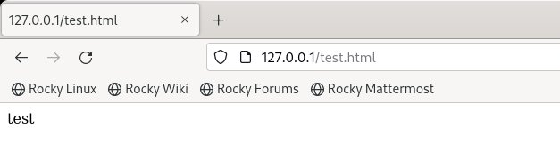{ #fig:011 width=90% }

Файл был успешно отображён

## Выполнение

Проверить контекст файла /var/www/html/test.html командой ls -Z.
ls -Z /var/www/html/test.html

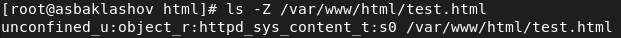{ #fig:012 width=90% }

## Выполнение

Измените контекст файла /var/www/html/test.html с httpd_sys_content_t на любой другой, к которому процесс httpd не должен иметь доступа, например, на samba_share_t

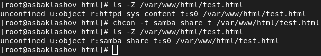{ #fig:013 width=90% }

## Выполнение

Попробуйте ещё раз получить доступ к файлу через веб-сервер, введя в браузере адрес http://127.0.0.1/test.html. Вы должны получить сообщение об ошибке 

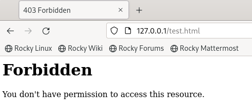{ #fig:014 width=90% }

## Выполнение

Проанализируйте ситуацию. Почему файл не был отображён, если права доступа позволяют читать этот файл любому пользователю? 

Просмотрите log-файлы веб-сервера Apache. Также просмотрите системный лог-файл:
tail /var/log/messages

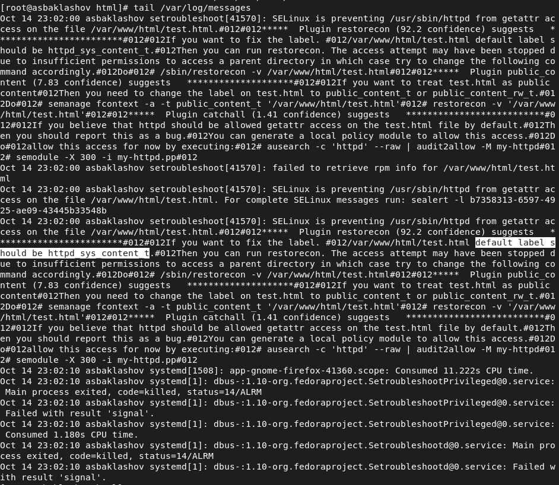{ #fig:015 width=50% }

## Выполнение

Попробуйте запустить веб-сервер Apache на прослушивание ТСР-порта 81 (а не 80, как рекомендует IANA и прописано в /etc/services). Для этого в файле /etc/httpd/httpd.conf найдите строчку Listen 80 и замените её на Listen 81.

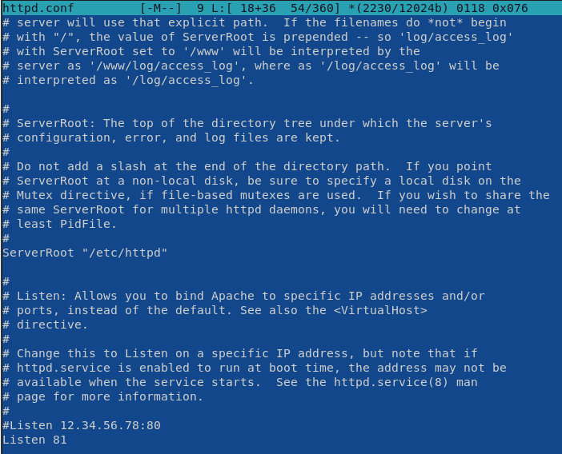{ #fig:016 width=50% }

## Выполнение

Выполните перезапуск веб-сервера Apache. Произошёл сбой? Поясните
почему? 

Сбоя нет.

## Выполнение

Проанализируйте лог-файлы:
tail -nl /var/log/messages
Просмотрите файлы /var/log/http/error_log,
/var/log/http/access_log и /var/log/audit/audit.log и
выясните, в каких файлах появились записи.

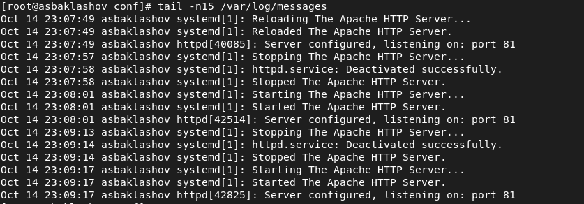{ #fig:0181 width=90% }

## Выполнение

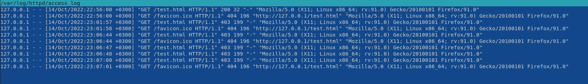{ #fig:0182 width=90% }

## Выполнение

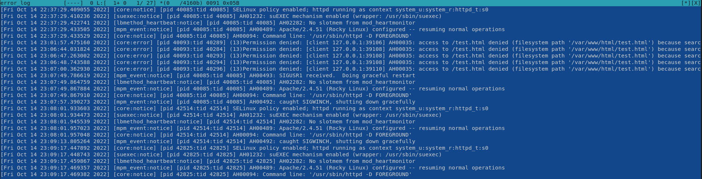{ #fig:0183 width=90% }

## Выполнение

Выполните команду
semanage port -a -t http_port_t -р tcp 81

После этого проверьте список портов командой
semanage port -l | grep http_port_t
Убедитесь, что порт 81 появился в списке.

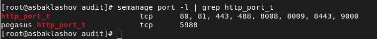{ #fig:019 width=90% }

Порт 81 был в списке до этого, поэтому сбоя не было.

## Выполнение

Попробуйте запустить веб-сервер Apache ещё раз. Поняли ли вы, почему
он сейчас запустился, а в предыдущем случае не смог? 

Сервер запускался и до этого. Он бы не запустился, если бы порта 81 изначально не было в списке.

## Выполнение

Верните контекст httpd_sys_cоntent__t к файлу /var/www/html/ test.html:
chcon -t httpd_sys_content_t /var/www/html/test.html
После этого попробуйте получить доступ к файлу через веб-сервер, введя в браузере адрес http://127.0.0.1:81/test.html.
Вы должны увидеть содержимое файла — слово «test».

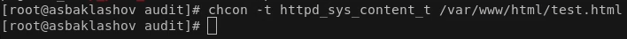{ #fig:025 width=90% }

## Выполнение

{ #fig:021 width=90% }

## Выполнение

Исправьте обратно конфигурационный файл apache, вернув Listen 80.

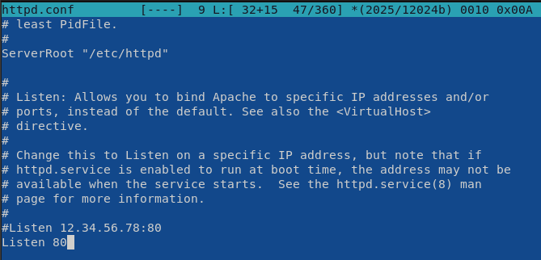{ #fig:022 width=90% }

## Выполнение

Удалите привязку http_port_t к 81 порту:
semanage port -d -t http_port_t -p tcp 81

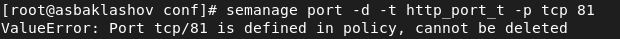{ #fig:023 width=90% }

Не вышло

## Выполнение

Удалите файл /var/www/html/test.html

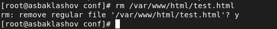{ #fig:024 width=90% }

# Выводы

В результате выполнения работы я развил навыки администрирования ОС Linux. Получил первое практическое знакомство с технологией SELinux.
Проверил работу SELinux на практике совместно с веб-сервером Apache.