---
# Front matter
title: "Отчёт по лабораторной работе №6. Мандатное разграничение прав в Linux"
subtitle: "Предмет: информационная безопасность"
author: "Александр Сергеевич Баклашов"

# Generic otions
lang: ru-RU
toc-title: "Содержание"

# Bibliography
bibliography: bib/cite.bib
csl: pandoc/csl/gost-r-7-0-5-2008-numeric.csl

# References settings
linkReferences: true
nameInLink: true

# Pdf output format
toc: true # Table of contents
toc_depth: 2
lof: true # List of figures
lot: false # List of tables
fontsize: 12pt
linestretch: 1.5
papersize: a4
documentclass: scrreprt
## I18n
polyglossia-lang:
  name: russian
  options:
	- spelling=modern
	- babelshorthands=true
polyglossia-otherlangs:
  name: english
### Fonts
mainfont: PT Serif
romanfont: PT Serif
sansfont: PT Sans
monofont: PT Mono
mainfontoptions: Ligatures=TeX
romanfontoptions: Ligatures=TeX
sansfontoptions: Ligatures=TeX,Scale=MatchLowercase
monofontoptions: Scale=MatchLowercase,Scale=0.9
## Biblatex
biblatex: true
biblio-style: "gost-numeric"
biblatexoptions:
  - parentracker=true
  - backend=biber
  - hyperref=auto
  - language=auto
  - autolang=other*
  - citestyle=gost-numeric
## Misc options
indent: true
header-includes:
  - \linepenalty=10 # the penalty added to the badness of each line within a paragraph (no associated penalty node) Increasing the value makes tex try to have fewer lines in the paragraph.
  - \interlinepenalty=0 # value of the penalty (node) added after each line of a paragraph.
  - \hyphenpenalty=50 # the penalty for line breaking at an automatically inserted hyphen
  - \exhyphenpenalty=50 # the penalty for line breaking at an explicit hyphen
  - \binoppenalty=700 # the penalty for breaking a line at a binary operator
  - \relpenalty=500 # the penalty for breaking a line at a relation
  - \clubpenalty=150 # extra penalty for breaking after first line of a paragraph
  - \widowpenalty=150 # extra penalty for breaking before last line of a paragraph
  - \displaywidowpenalty=50 # extra penalty for breaking before last line before a display math
  - \brokenpenalty=100 # extra penalty for page breaking after a hyphenated line
  - \predisplaypenalty=10000 # penalty for breaking before a display
  - \postdisplaypenalty=0 # penalty for breaking after a display
  - \floatingpenalty = 20000 # penalty for splitting an insertion (can only be split footnote in standard LaTeX)
  - \raggedbottom # or \flushbottom
  - \usepackage{float} # keep figures where there are in the text
  - \floatplacement{figure}{H} # keep figures where there are in the text
---

# Цель работы

Развить навыки администрирования ОС Linux. Получить первое практическое знакомство с технологией SELinux.
Проверить работу SELinux на практике совместно с веб-сервером Apache. [1]

# Теоретическое введение

Информационная безопасность – это защищенность информации и поддерживающей инфраструктуры от случайных или преднамеренных воздействий естественного или искусственного характера, чреватых нанесением ущерба владельцам или пользователям информации и поддерживающей инфраструктуры.

# Выполнение лабораторной работы

1. Войдите в систему с полученными учётными данными и убедитесь, что SELinux работает в режиме enforcing политики targeted с помощью команд getenforce и sestatus. (рис. [-@fig:001])

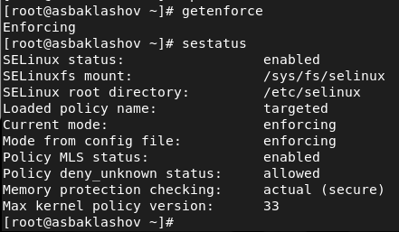{ #fig:001 width=80% }

2. Обратитесь с помощью браузера к веб-серверу, запущенному на вашем компьютере, и убедитесь, что последний работает (рис. [-@fig:002])

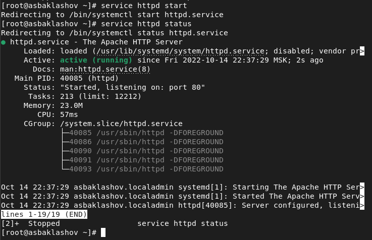{ #fig:002 width=90% }

3. Найдите веб-сервер Apache в списке процессов, определите его контекст безопасности и занесите эту информацию в отчёт. (рис. [-@fig:003])

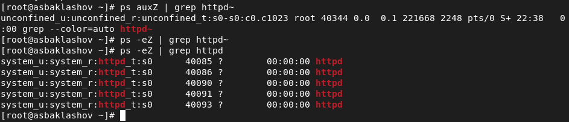{ #fig:003 width=90% }

httpd_sys_cоntent_t

4. Посмотрите текущее состояние переключателей SELinux для Apache. (рис. [-@fig:004])

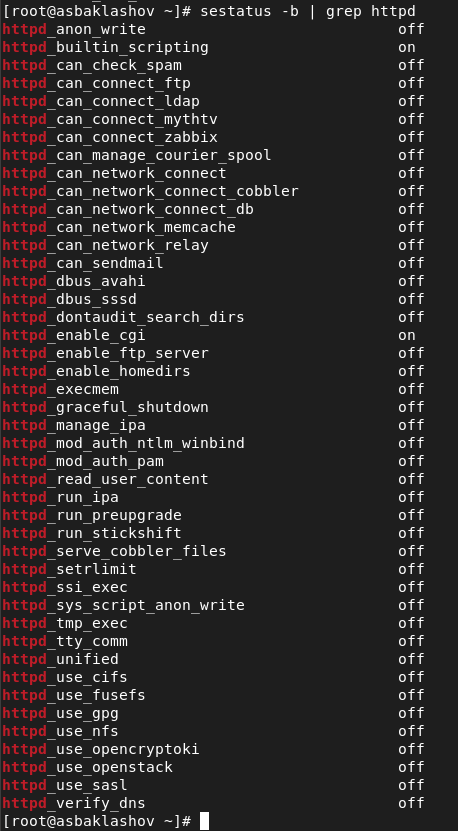{ #fig:004 width=70% }

5. Посмотрите статистику по политике с помощью команды seinfo, также определите множество пользователей, ролей, типов. (рис. [-@fig:005])

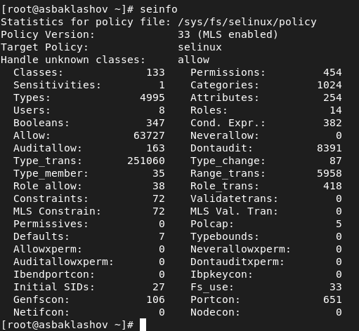{ #fig:005 width=90% }

6. Определите тип файлов и поддиректорий, находящихся в директории 
/var/www (рис. [-@fig:006])

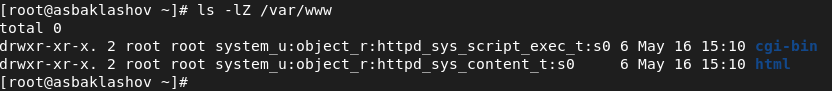{ #fig:006 width=90% }

7. Определите тип файлов, находящихся в директории /var/www/html (рис. [-@fig:007])

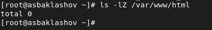{ #fig:007 width=90% }

8. Определите круг пользователей, которым разрешено создание файлов в директории /var/www/html (рис. [-@fig:008])

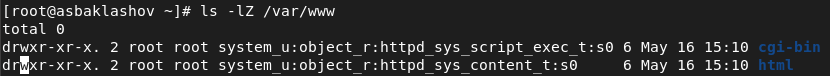{ #fig:008 width=90% }

Только владелец

9. Создайте от имени суперпользователя (так как в дистрибутиве после установки только ему разрешена запись в директорию) html-файл 
/var/www/html/test.html следующего содержания:

< html >

< body >test< /body >

< /html > 

(рис. [-@fig:009])

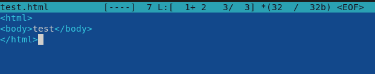{ #fig:009 width=90% }

10. Проверьте контекст созданного вами файла. Занесите в отчёт контекст, присваиваемый по умолчанию вновь созданным файлам в директории /var/www/html (рис. [-@fig:010])

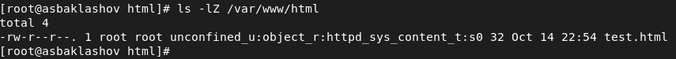{ #fig:010 width=90% }

httpd_sys_cоntent_t

11. Обратитесь к файлу через веб-сервер, введя в браузере адрес http://127.0.0.1/test.html. Убедитесь, что файл был успешно отображён. (рис. [-@fig:011])

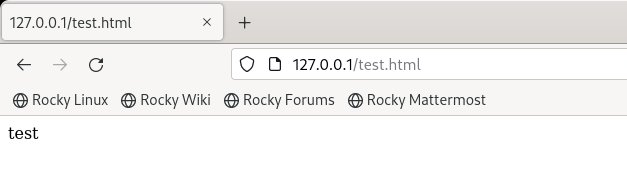{ #fig:011 width=90% }

Файл был успешно отображён

12. Проверить контекст файла /var/www/html/test.html командой ls -Z.
ls -Z /var/www/html/test.html (рис. [-@fig:012])

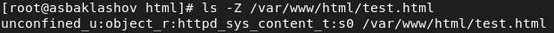{ #fig:012 width=90% }

13. Измените контекст файла /var/www/html/test.html с httpd_sys_content_t на любой другой, к которому процесс httpd не должен иметь доступа, например, на samba_share_t (рис. [-@fig:013])

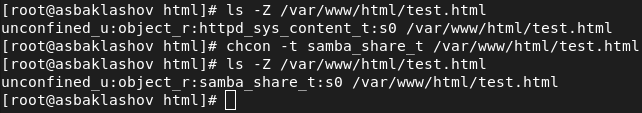{ #fig:013 width=90% }

14. Попробуйте ещё раз получить доступ к файлу через веб-сервер, введя в браузере адрес http://127.0.0.1/test.html. Вы должны получить сообщение об ошибке (рис. [-@fig:014])

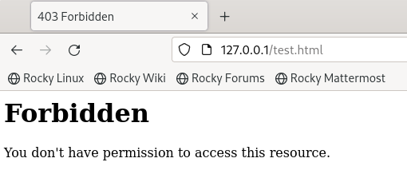{ #fig:014 width=90% }

15. Проанализируйте ситуацию. Почему файл не был отображён, если права доступа позволяют читать этот файл любому пользователю? 

Просмотрите log-файлы веб-сервера Apache. Также просмотрите системный лог-файл:
tail /var/log/messages (рис. [-@fig:015])

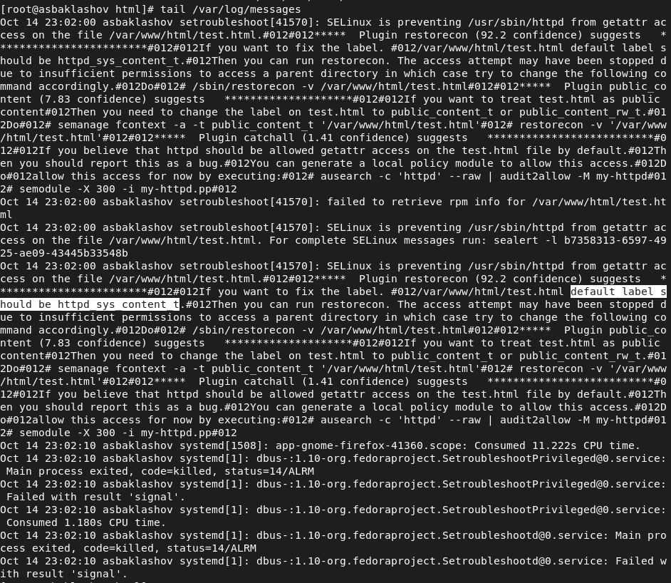{ #fig:015 width=90% }

16. Попробуйте запустить веб-сервер Apache на прослушивание ТСР-порта 81 (а не 80, как рекомендует IANA и прописано в /etc/services). Для этого в файле /etc/httpd/httpd.conf найдите строчку Listen 80 и замените её на Listen 81. (рис. [-@fig:016])

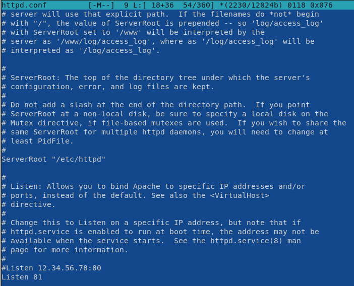{ #fig:016 width=90% }

17. Выполните перезапуск веб-сервера Apache. Произошёл сбой? Поясните
почему? 

Сбоя нет.

18. Проанализируйте лог-файлы:
tail -nl /var/log/messages
Просмотрите файлы /var/log/http/error_log,
/var/log/http/access_log и /var/log/audit/audit.log и
выясните, в каких файлах появились записи. (рис. [-@fig:0181], рис. [-@fig:0182],рис. [-@fig:0183])

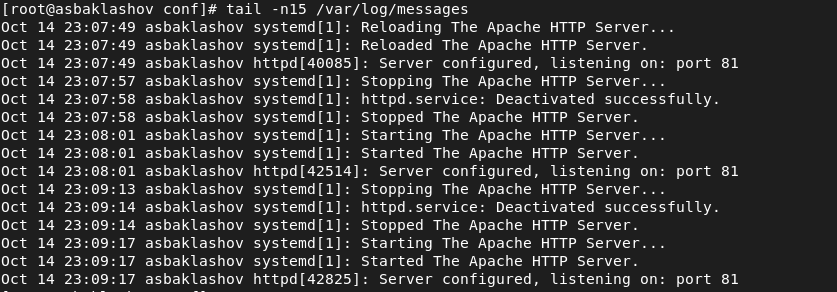{ #fig:0181 width=90% }

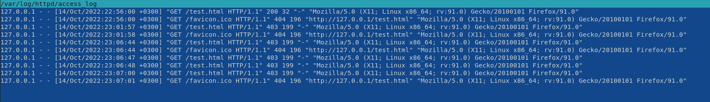{ #fig:0182 width=90% }

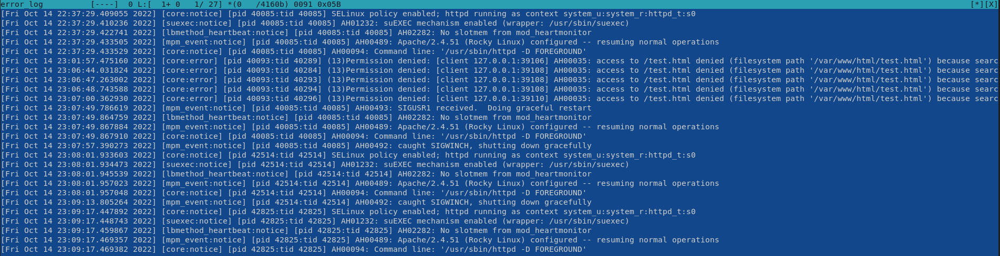{ #fig:0183 width=90% }

19. Выполните команду
semanage port -a -t http_port_t -р tcp 81

После этого проверьте список портов командой
semanage port -l | grep http_port_t
Убедитесь, что порт 81 появился в списке. (рис. [-@fig:019])

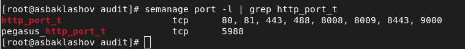{ #fig:019 width=90% }

Порт 81 был в списке до этого, поэтому сбоя не было.

20. Попробуйте запустить веб-сервер Apache ещё раз. Поняли ли вы, почему
он сейчас запустился, а в предыдущем случае не смог? 

Сервер запускался и до этого. Он бы не запустился, если бы порта 81 изначально не было в списке.

21. Верните контекст httpd_sys_cоntent__t к файлу /var/www/html/ test.html:
chcon -t httpd_sys_content_t /var/www/html/test.html
После этого попробуйте получить доступ к файлу через веб-сервер, введя в браузере адрес http://127.0.0.1:81/test.html.
Вы должны увидеть содержимое файла — слово «test». (рис. [-@fig:025], рис. [-@fig:021])

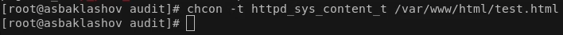{ #fig:025 width=90% }

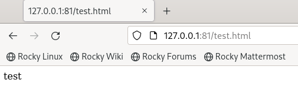{ #fig:021 width=90% }

22. Исправьте обратно конфигурационный файл apache, вернув Listen 80. (рис. [-@fig:022])

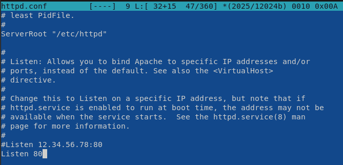{ #fig:022 width=90% }

23. Удалите привязку http_port_t к 81 порту:
semanage port -d -t http_port_t -p tcp 81 (рис. [-@fig:023])

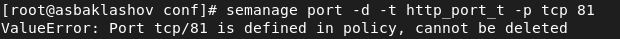{ #fig:023 width=90% }

Не вышло

24. Удалите файл /var/www/html/test.html (рис. [-@fig:024])

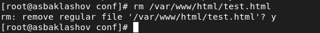{ #fig:024 width=90% }

# Вывод

В результате выполнения работы я развил навыки администрирования ОС Linux. Получил первое практическое знакомство с технологией SELinux.
Проверил работу SELinux на практике совместно с веб-сервером Apache.

# Библиография

1. Лабораторная работа № 6. Мандатное
разграничение прав в Linux. - 5 с. [Электронный ресурс]. М. URL: [Лабораторная работа №6](https://esystem.rudn.ru/pluginfile.php/1651891/mod_resource/content/2/006-lab_selinux.pdf) (Дата обращения: 15.10.2022).

2. Rocky Linux Documentation. [Электронный ресурс]. М. URL: [Rocky Linux Documentation](https://docs.rockylinux.org) (Дата обращения: 15.10.2022).