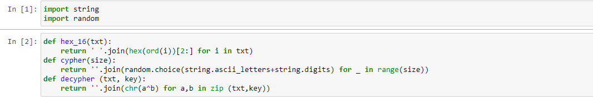
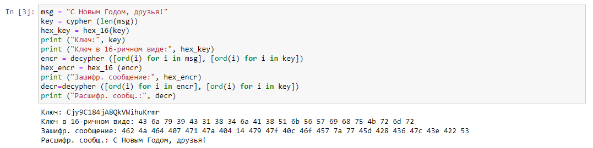
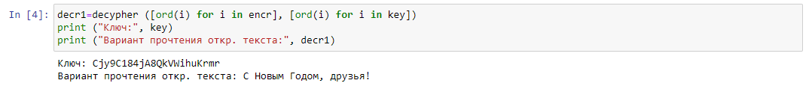

---
## Front matter
lang: ru-RU
title: Лабораторная работа  №7. Элементы криптографии. Однократное гаммирование.
author: |
	Alexander S. Baklashov
institute: |
	RUDN University, Moscow, Russian Federation

date: 18 October, 2022

## Formatting
toc: false
slide_level: 2
theme: metropolis
header-includes: 
 - \metroset{progressbar=frametitle,sectionpage=progressbar,numbering=fraction}
 - '\makeatletter'
 - '\beamer@ignorenonframefalse'
 - '\makeatother'
aspectratio: 43
section-titles: true
---

# Цель работы

Освоить на практике применение режима однократного гаммирования. 

# Выполнение лабораторной работы

## Выполнение

Создадим функции для перевода в 16-ричный вид, шифрования и дешифрования, а также импортируем необх. библиотеки. 

{ #fig:001 width=80% }

## Выполнение

Создадим код для получения шифротекста. 

{ #fig:002 width=90% }

## Выполнение

Создадим код для получения варианта прочтения открытого текста. 

{ #fig:003 width=90% }

# Выводы

В результате выполнения работы я освоил на практике применение режима однократного гаммирования.