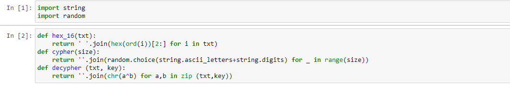
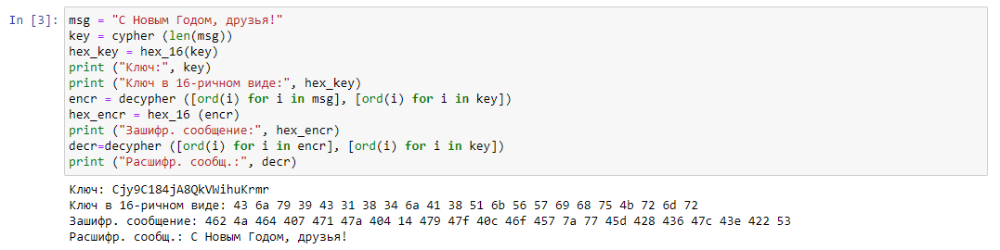

---
# Front matter
title: "Отчёт по лабораторной работе №7. Элементы криптографии. Однократное гаммирование."
subtitle: "Предмет: информационная безопасность"
author: "Александр Сергеевич Баклашов"

# Generic otions
lang: ru-RU
toc-title: "Содержание"

# Bibliography
bibliography: bib/cite.bib
csl: pandoc/csl/gost-r-7-0-5-2008-numeric.csl

# References settings
linkReferences: true
nameInLink: true

# Pdf output format
toc: true # Table of contents
toc_depth: 2
lof: true # List of figures
lot: false # List of tables
fontsize: 12pt
linestretch: 1.5
papersize: a4
documentclass: scrreprt
## I18n
polyglossia-lang:
  name: russian
  options:
	- spelling=modern
	- babelshorthands=true
polyglossia-otherlangs:
  name: english
### Fonts
mainfont: PT Serif
romanfont: PT Serif
sansfont: PT Sans
monofont: PT Mono
mainfontoptions: Ligatures=TeX
romanfontoptions: Ligatures=TeX
sansfontoptions: Ligatures=TeX,Scale=MatchLowercase
monofontoptions: Scale=MatchLowercase,Scale=0.9
## Biblatex
biblatex: true
biblio-style: "gost-numeric"
biblatexoptions:
  - parentracker=true
  - backend=biber
  - hyperref=auto
  - language=auto
  - autolang=other*
  - citestyle=gost-numeric
## Misc options
indent: true
header-includes:
  - \linepenalty=10 # the penalty added to the badness of each line within a paragraph (no associated penalty node) Increasing the value makes tex try to have fewer lines in the paragraph.
  - \interlinepenalty=0 # value of the penalty (node) added after each line of a paragraph.
  - \hyphenpenalty=50 # the penalty for line breaking at an automatically inserted hyphen
  - \exhyphenpenalty=50 # the penalty for line breaking at an explicit hyphen
  - \binoppenalty=700 # the penalty for breaking a line at a binary operator
  - \relpenalty=500 # the penalty for breaking a line at a relation
  - \clubpenalty=150 # extra penalty for breaking after first line of a paragraph
  - \widowpenalty=150 # extra penalty for breaking before last line of a paragraph
  - \displaywidowpenalty=50 # extra penalty for breaking before last line before a display math
  - \brokenpenalty=100 # extra penalty for page breaking after a hyphenated line
  - \predisplaypenalty=10000 # penalty for breaking before a display
  - \postdisplaypenalty=0 # penalty for breaking after a display
  - \floatingpenalty = 20000 # penalty for splitting an insertion (can only be split footnote in standard LaTeX)
  - \raggedbottom # or \flushbottom
  - \usepackage{float} # keep figures where there are in the text
  - \floatplacement{figure}{H} # keep figures where there are in the text
---

# Цель работы

Освоить на практике применение режима однократного гаммирования. [1]

# Теоретическое введение

Информационная безопасность – это защищенность информации и поддерживающей инфраструктуры от случайных или преднамеренных воздействий естественного или искусственного характера, чреватых нанесением ущерба владельцам или пользователям информации и поддерживающей инфраструктуры.

# Выполнение лабораторной работы

1. Создадим функции для перевода в 16-ричный вид, шифрования и дешифрования, а также импортируем необх. библиотеки. (рис. [-@fig:001])

{ #fig:001 width=80% }

2. Создадим код для получения шифротекста. (рис. [-@fig:002])

{ #fig:002 width=90% }

3. Создадим код для получения варианта прочтения открытого текста. (рис. [-@fig:003])

{ #fig:003 width=90% }

# Вывод

В результате выполнения работы я освоил на практике применение режима однократного гаммирования.

# Контрольные вопросы

1. Поясните смысл однократного гаммирования.

Гаммирование - выполнение операции
сложения по модулю 2 (XOR) между элементами гаммы и элементами подлежащего сокрытию текста. Если в методе шифрования используется однократная вероятностная гамма (однократное гаммирование) той же длины, что и подлежащий сокрытию текст, то текст нельзя раскрыть. Даже при раскрытии части последовательности гаммы нельзя получить информацию о всём скрываемом тексте.

2. Перечислите недостатки однократного гаммирования.

Абсолютная стойкость шифра доказана только в случае, когда однократно используемый ключ, длиной, равной длине исходного сообщения, является фрагментом истинно случайной двоичной последовательности с равномерным законом распределения.

3. Перечислите преимущества однократного гаммирования.

Такой метод шифрования является симметричным, так как двойное прибавление одной и той же величины по модулю 2 восстанавливает исходное значение, а шифрование и расшифрование выполняется одной и той же программой. Криптоалгоритм не даёт никакой информации об открытом тексте: при известном зашифрованном сообщении C все различные ключевые последовательности K возможны и равновероятны, а значит, возможны и любые сообщения P.

4. Почему длина открытого текста должна совпадать с длиной ключа?

Если ключ длиннее текста - появится неоднозначность декодирования, а если короче - операция XOR будет применена не ко всем элементам.

5. Какая операция используется в режиме однократного гаммирования, назовите её особенности?

Используется операция XOR, которая является симметричной.

6. Как по открытому тексту и ключу получить шифротекст?

Если известны ключ и открытый текст, то задача нахождения шифротекста заключается в применении к каждому символу открытого текста следующего правила:
Ci = Pi (+) Ki
где Ci — i-й символ получившегося зашифрованного послания, Pi — i-й символ открытого текста, Ki — i-й символ ключа, i = 1, m. 

7. Как по открытому тексту и шифротексту получить ключ?

Если известны шифротекст и открытый текст, то обе части равенства необходимо сложить по модулю 2 с Pi:
Ci (+) Pi = Pi (+) Ki (+) Pi = Ki,
Ki = Ci (+) Pi.

8. В чем заключаются необходимые и достаточные условия абсолютной стойкости шифра?

Необходимые и достаточные условия абсолютной стойкости шифра:
– полная случайность ключа;
– равенство длин ключа и открытого текста;
– однократное использование ключа.

# Библиография

1. Лабораторная работа № 7. Элементы
криптографии. Однократное гаммирование. - 3 с. [Электронный ресурс]. М. URL: [Лабораторная работа №6](file:///C:/Users/bakla/Labs%20IAD/Lab6/007-lab_crypto-gamma.pdf) (Дата обращения: 18.10.2022).