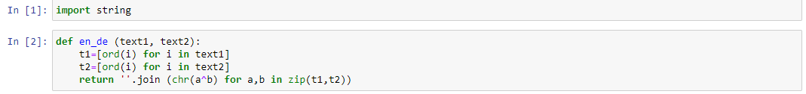
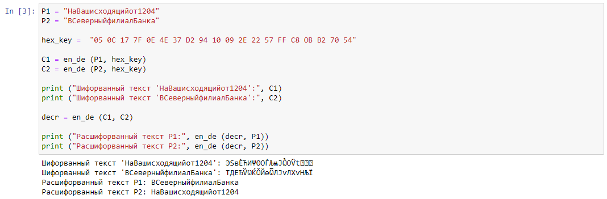

---
# Front matter
title: "Отчёт по лабораторной работе №8. Элементы криптографии. Шифрование (кодирование) различных исходных текстов одним ключом."
subtitle: "Предмет: информационная безопасность"
author: "Александр Сергеевич Баклашов"

# Generic otions
lang: ru-RU
toc-title: "Содержание"

# Bibliography
bibliography: bib/cite.bib
csl: pandoc/csl/gost-r-7-0-5-2008-numeric.csl

# References settings
linkReferences: true
nameInLink: true

# Pdf output format
toc: true # Table of contents
toc_depth: 2
lof: true # List of figures
lot: false # List of tables
fontsize: 12pt
linestretch: 1.5
papersize: a4
documentclass: scrreprt
## I18n
polyglossia-lang:
  name: russian
  options:
	- spelling=modern
	- babelshorthands=true
polyglossia-otherlangs:
  name: english
### Fonts
mainfont: PT Serif
romanfont: PT Serif
sansfont: PT Sans
monofont: PT Mono
mainfontoptions: Ligatures=TeX
romanfontoptions: Ligatures=TeX
sansfontoptions: Ligatures=TeX,Scale=MatchLowercase
monofontoptions: Scale=MatchLowercase,Scale=0.9
## Biblatex
biblatex: true
biblio-style: "gost-numeric"
biblatexoptions:
  - parentracker=true
  - backend=biber
  - hyperref=auto
  - language=auto
  - autolang=other*
  - citestyle=gost-numeric
## Misc options
indent: true
header-includes:
  - \linepenalty=10 # the penalty added to the badness of each line within a paragraph (no associated penalty node) Increasing the value makes tex try to have fewer lines in the paragraph.
  - \interlinepenalty=0 # value of the penalty (node) added after each line of a paragraph.
  - \hyphenpenalty=50 # the penalty for line breaking at an automatically inserted hyphen
  - \exhyphenpenalty=50 # the penalty for line breaking at an explicit hyphen
  - \binoppenalty=700 # the penalty for breaking a line at a binary operator
  - \relpenalty=500 # the penalty for breaking a line at a relation
  - \clubpenalty=150 # extra penalty for breaking after first line of a paragraph
  - \widowpenalty=150 # extra penalty for breaking before last line of a paragraph
  - \displaywidowpenalty=50 # extra penalty for breaking before last line before a display math
  - \brokenpenalty=100 # extra penalty for page breaking after a hyphenated line
  - \predisplaypenalty=10000 # penalty for breaking before a display
  - \postdisplaypenalty=0 # penalty for breaking after a display
  - \floatingpenalty = 20000 # penalty for splitting an insertion (can only be split footnote in standard LaTeX)
  - \raggedbottom # or \flushbottom
  - \usepackage{float} # keep figures where there are in the text
  - \floatplacement{figure}{H} # keep figures where there are in the text
---

# Цель работы

Освоить на практике применение режима однократного гаммирования на примере кодирования различных исходных текстов одним ключом. [1]

# Теоретическое введение

Информационная безопасность – это защищенность информации и поддерживающей инфраструктуры от случайных или преднамеренных воздействий естественного или искусственного характера, чреватых нанесением ущерба владельцам или пользователям информации и поддерживающей инфраструктуры.

# Выполнение лабораторной работы

1. Создадим функцию для шифрования и дешифрования, а также импортируем необх. библиотеки. (рис. [-@fig:001])

{ #fig:001 width=80% }

2. Создадим код для выполнения поставленной задачи. (рис. [-@fig:002])

{ #fig:002 width=90% }

# Вывод

В результате выполнения работы я освоил на практике применение режима однократного гаммирования на примере кодирования различных исходных текстов одним ключом.

# Контрольные вопросы

1. Как, зная один из текстов (P1 или P2), определить другой, не зная при этом ключа?

Воспользуемся формулой:

C1 (+) C2 (+) P1 = P1 (+) P2 (+) P1 = P2.

C1 и C2 - шифрованные тексты, P1 и P2 - исходные тексты. Ключа K в формуле нет.

2. Что будет при повторном использовании ключа при шифровании текста?

Мы получим исходное сообщение.

3. Как реализуется режим шифрования однократного гаммирования одним ключом двух открытых текстов?

Шифротексты обеих текстов можно получить по формулам режима однократного гаммирования:
C1 = P1 (+) K,
C2 = P2 (+) K.

4. Перечислите недостатки шифрования одним ключом двух открытых текстов.

Можно расшифровать одно из сообщений, зная другое сообщение в открытом виде.

5. Перечислите преимущества шифрования одним ключом двух открытых текстов.

Упрощает дешифровку. Удобен в локальных сетях.

# Библиография

1. Лабораторная работа № 8. Элементы криптографии. Шифрование (кодирование) различных исходных текстов одним ключом. - 3 с. [Электронный ресурс]. М. URL: [Лабораторная работа №8](https://esystem.rudn.ru/pluginfile.php/1651895/mod_resource/content/2/008-lab_crypto-key.pdf) (Дата обращения: 29.10.2022).